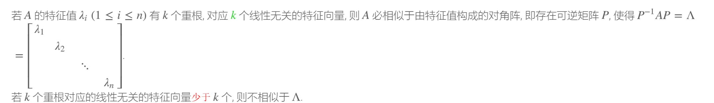

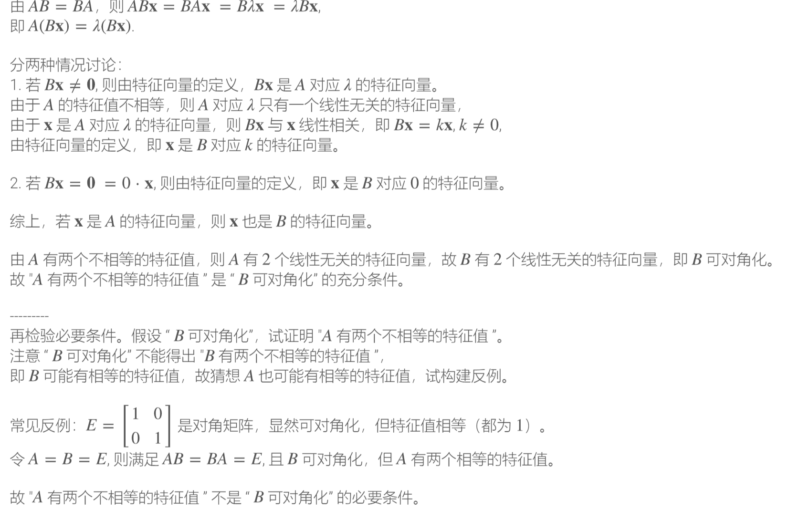

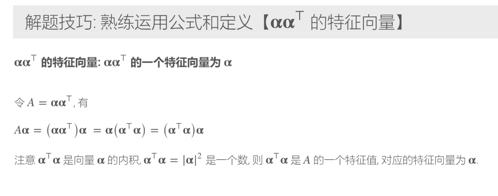

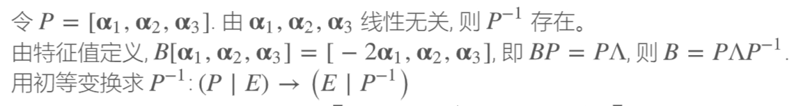

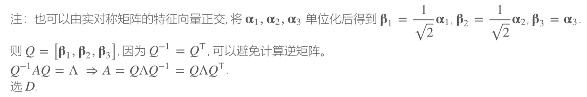

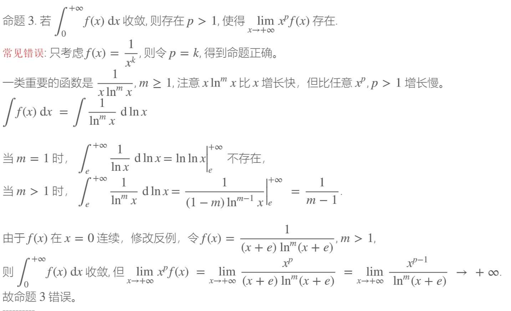

## 2024年10月11日23点19分48秒
甲辰年(龙)九月初九子时(夜半｜三更)
## 甲辰年(龙)九月初十

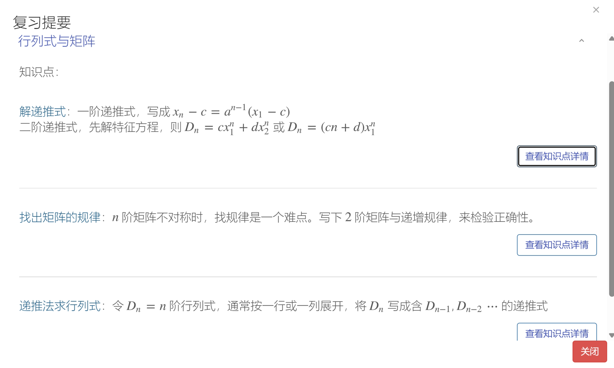

$$r(a*{a^T})<=1$$

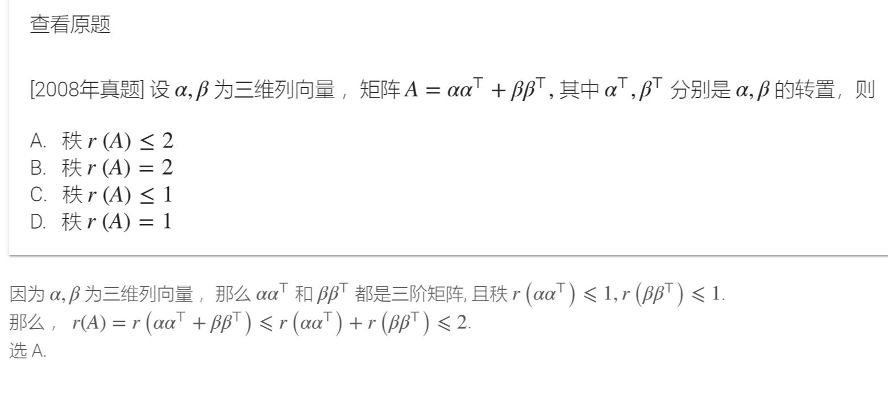
###　克拉莫法则
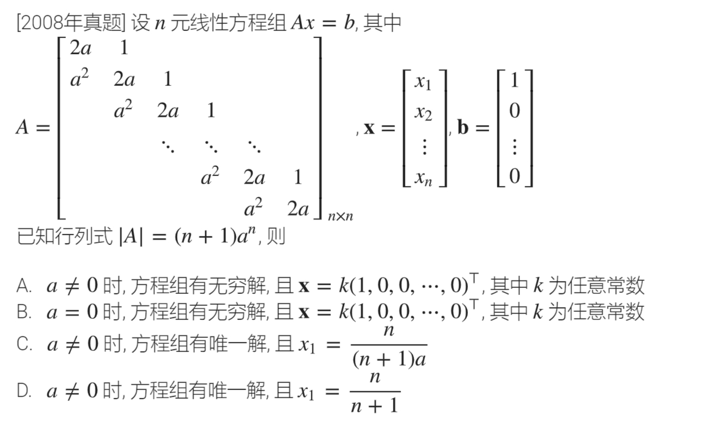

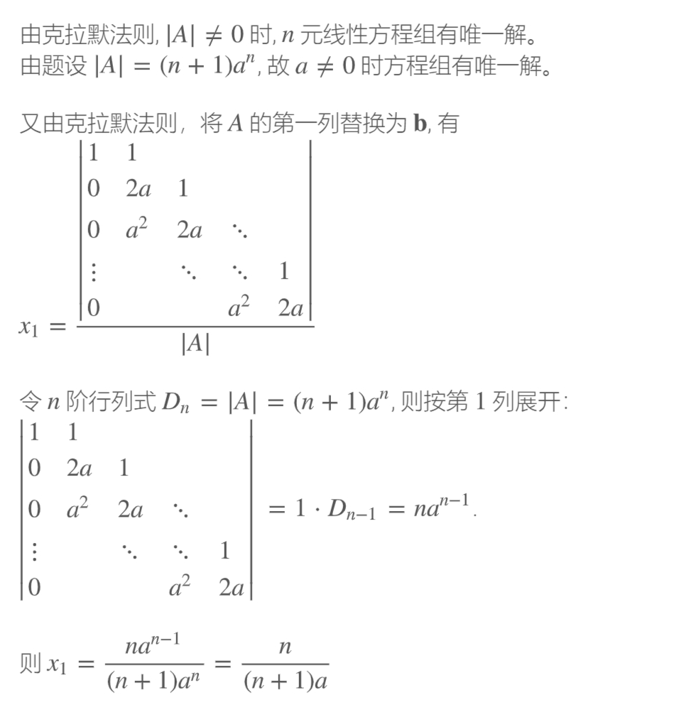
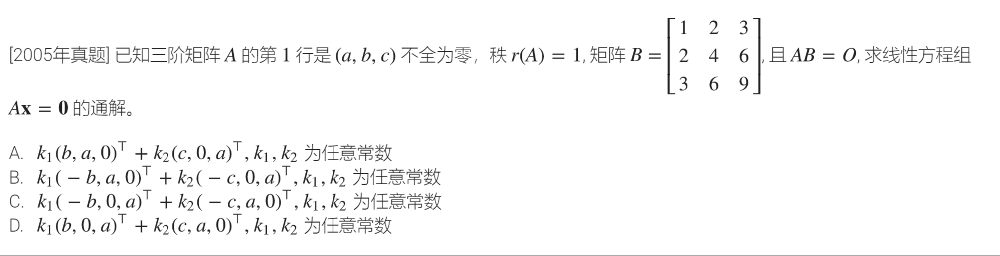
经典错误

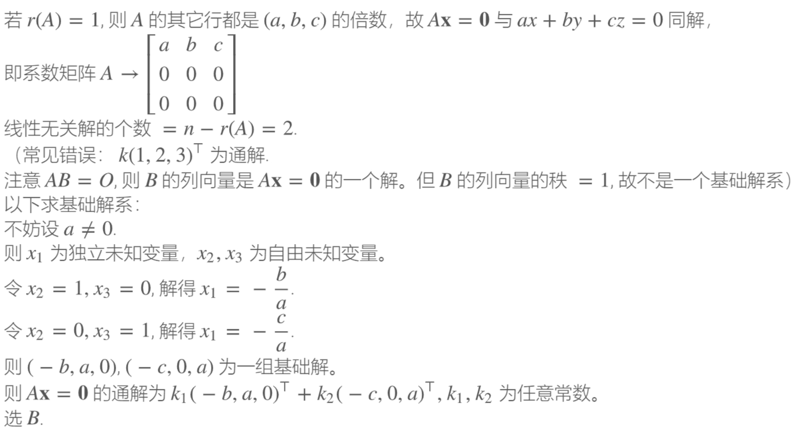
2024.10.12 
甲辰年(龙)九月初十子时(夜半｜三更) 
### 2024.10.13
$A \alpha = \lambda \alpha$
$ A{^{-1}}=1/\lambda \alpha $
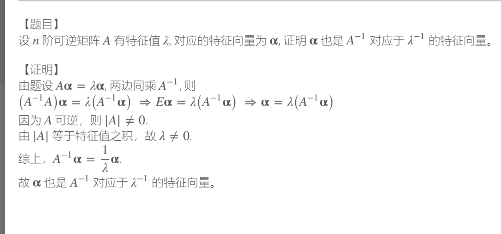
$\alpha $
$x+1\frac$