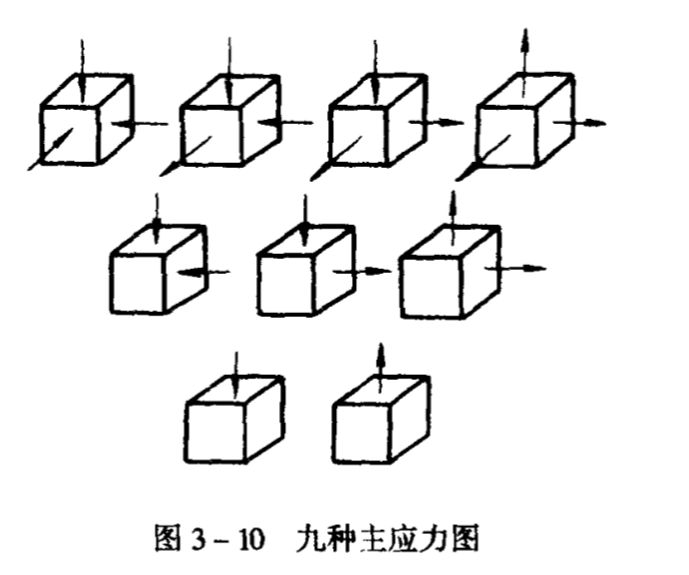

# 塑性

# 七、提高金属塑性的基本途径}

## 应力边界条件

$T_{x}=\sigma_{x}l+\tau_{yx}m+\tau_{zx}n\\T_{y}=\tau_{xy}l+\sigma_{y}m+\tau_{zy}n\\T_{z}=\tau_{xz}l+\tau_{yz}m+\sigma_{z}n$

$( \sigma_{x}-\sigma) l+\tau_{yx}m+\tau_{xx}n=0\\\tau_{xy}l + ( \sigma_{y}-\sigma ) m + \tau_{xy}n=0\\\tau_{xx}l + \tau_{yx}m + ( \sigma_{z} - \sigma ) n=0$

$\begin{array}{|ccc}( \sigma_{x}-\sigma )&\tau_{yx}&\tau_{xx}\\\tau_{xy}&( \sigma_{y}-\sigma )&\tau_{zy}\\\tau_{xz}&\tau_{yz}&( \sigma_{z}-\sigma )\end{array} =0$

$\begin{aligned}&J_{1}=\sigma_{z}+\sigma_{y}+\sigma_{z}\\&J_{2}=- ( \sigma_{x}\sigma_{y}+\sigma_{y}\sigma_{z}+\sigma_{z}\sigma_{x} ) + \tau_{xy}^{2}+\tau_{yz}^{2}+\tau_{zz}^{2}\\&J_{3}=\sigma_{z}\sigma_{y}\sigma_{z}+2\tau_{xy}\tau_{yz}\tau_{zz}- ( \sigma_{x}\tau_{yz}^{2}+\sigma_{y}\tau_{zz}^{2}+\sigma_{z}\tau_{zy}^{2} )\end{aligned}$

$\sigma^{3}-J_{1}\sigma^{2}-J_{2}\sigma-J_{3}=0$

## 应力偏张量和应力球张量

$\begin{aligned}\sigma_{ij}&=\left[\begin{array}{ccc}{\sigma_{x}}&{\tau_{xy}}&{\tau_{xx}}\\{\tau_{yx}}&{\sigma_{y}}&{\tau_{yx}}\\{\tau_{xx}}&{\tau_{xy}}&{\sigma_{z}}\\\end{array}\right]=\left[\begin{array}{ccc}{\sigma_{x}-\sigma_{m}}&{\tau_{xy}}&{\tau_{xx}}\\{\tau_{yx}}&{\sigma_{y}-\sigma_{m}}&{\tau_{yx}}\\{\tau_{zx}}&{\tau_{zy}}&{\sigma_{z}-\sigma_{m}}\\\end{array}\right]+\left[\begin{array}{ccc}{\sigma_{m}}&{0}&{0}\\{0}&{\sigma_{m}}&{0}\\{0}&{0}&{\sigma_{m}}\\\end{array}\right]\\&=\sigma_{ij}{}^{\prime}+\delta_{ij}\sigma_{m}\end{aligned}$

## 八面体正应力和八面体切应力

$\begin{aligned}&\sigma_{8}=\frac{1}{3} ( \sigma_{1}+\sigma_{2}+\sigma_{3} ) = \sigma_{\mathrm{m}}=\frac{1}{3} J_{1}\\&\tau_{8}=\pm\frac{1}{3}\sqrt{(\sigma_{1}-\sigma_{2})^{2}+(\sigma_{2}-\sigma_{3})^{2}+\sigma_{3}-\sigma_{1})^{2}}\\&=\pm\frac{2}{3}\sqrt{\tau_{12}^{2}+\tau_{23}^{2}+\tau_{31}^{2}}=\pm\sqrt{\frac{2}{3}J_{2}^{\prime}}\end{aligned}$

## 等效应力

$\overline{\sigma}=\frac{1}{\sqrt{2}}\sqrt{( \sigma_{z}-\sigma_{y} )^{2}+ ( \sigma_{y}-\sigma_{z} )^{2}+ ( \sigma_{z}-\sigma_{z} )^{2}+6 ( \tau_{zy}^{2}+\tau_{yz}^{2}+\tau_{zz}^{2} )}$

## 应力莫尔圆

### 平面应力状态

$\left(\sigma-\frac{\sigma_{x}+\sigma_{y}}{2}\right)^{2}+\tau^{2}=\left(\frac{\sigma_{x}-\sigma_{y}}{2}\right)^{2}+\tau_{xy}^{2}$

### 三向应力莫尔圆

$\left(\sigma-\frac{\sigma_{2}+\sigma_{3}}{2}\right)^{2}+\tau^{2}=\left(\frac{\sigma_{2}-\sigma_{3}}{2}\right)^{2}=\tau_{23}^{2}\\\left(\sigma-\frac{\sigma_{3}+\sigma_{1}}{2}\right)^{2}+\tau^{2}=\left(\frac{\sigma_{3}-\sigma_{1}}{2}\right)^{2}=\tau_{31}^{2}\\\left(\sigma-\frac{\sigma_{1}+\sigma_{2}}{2}\right)^{2}+\tau^{2}=\left(\frac{\sigma_{1}-\sigma_{2}}{2}\right)^{2}=\tau_{12}^{2}$

## 应力平衡方程

$\frac{\partial\sigma_{x}}{\partial x}+\frac{\partial\tau_{yz}}{\partial y}+\frac{\partial\tau_{zz}}{\partial z}=0\\\frac{\partial\tau_{xy}}{\partial x}+\frac{\partial\sigma_{y}}{\partial y}+\frac{\partial\tau_{zy}}{\partial z}=0\\\frac{\partial\tau_{xz}}{\partial x}+\frac{\partial\tau_{yz}}{\partial y}+\frac{\partial\sigma_{z}}{\partial z}=0$

$\frac{\partial\sigma_{ij}}{\partial x_{i}}=0$

### 对数应变

$\in=\int_{l_{0}}^{l_{n}}\frac{\mathrm{d}l}{l} = \ln\frac{l_{n}}{l_{0}}$

\
$\begin{aligned}\in_{l}+\in_{b}+\in_{h}&=\ln\frac{l}{l_{0}}+\ln\frac{b_{1}}{b_{0}}+\ln\frac{h_{1}}{h_{0}}\\&=\ln\frac{l_{1}b_{1}h_{1}}{l_{0}b_{0}h_{0}}=0\end{aligned}$

## 小应变几何方程

$\varepsilon_{x}=\frac{\partial u}{\partial x}\gamma_{xy}=\gamma_{yx}=\frac{1}{2}\Big(\frac{\partial u}{\partial y}+\frac{\partial v}{\partial x}\Big)\\\varepsilon_{y}=\frac{\partial v}{\partial y}\gamma_{yz}=\gamma_{xy}=\frac{1}{2}\Big(\frac{\partial v}{\partial z}+\frac{\partial w}{\partial y}\Big)\\\varepsilon_{z}=\frac{\partial w}{\partial z}\gamma_{xx}=\gamma_{xx}=\frac{1}{2}\Big(\frac{\partial w}{\partial x}+\frac{\partial u}{\partial z}\Big)$

$\varepsilon_{ij}=\frac{1}{2}\Big[\frac{\partial u_{i}}{\partial x_{j}}+\frac{\partial u_{j}}{\partial x_{i}}\Big]$

## 应变连续方程

$\frac{\partial}{\partial y}\Big(\frac{\partial\gamma_{xy}}{\partial z}+\frac{\partial\gamma_{yx}}{\partial x}-\frac{\partial\gamma_{xy}}{\partial y}\Big)=\frac{\partial^{2}\varepsilon_{y}}{\partial z\partial x}\\\frac{\partial}{\partial z}\Big(\frac{\partial\gamma_{xx}}{\partial x}+\frac{\partial\gamma_{xx}}{\partial y}-\frac{\partial\gamma_{xy}}{\partial z}\Big)=\frac{\partial^{2}\varepsilon_{z}}{\partial x\partial y}\\\frac{\partial}{\partial x}\Big(\frac{\partial\gamma_{xx}}{\partial y}+\frac{\partial\gamma_{xy}}{\partial z}-\frac{\partial\gamma_{xx}}{\partial x}\Big)=\frac{\partial^{2}\varepsilon_{x}}{\partial y\partial z}$

# 屈服准则

## Tresca

$\tau_{\max}=\left|\frac{\sigma_{\max}-\sigma_{\min}}{2}\right|=C$

$\sigma_{1}-\sigma_{2}=\pm2K=\pm\sigma_{s}\\\sigma_{2}-\sigma_{3}=\pm2K=\pm\sigma_{s}\\\sigma_{3}-\sigma_{1}=\pm2K=\pm\sigma_{s}$

## Mises

$(\sigma_{x}-\sigma_{y})^{2}+ (\sigma_{y}-\sigma_{z})^{2}+ (\sigma_{z}-\sigma_{z})^{2}+6 (\tau_{xy}^{2}+\tau_{yz}^{2}+\tau_{xz}^{2}) =2\sigma_{s}^{2}=6K^{2}$

$\overline{\sigma}=\frac{1}{\sqrt{2}}\sqrt{( \sigma_{z}-\sigma_{y} )^{2}+ ( \sigma_{y}-\sigma_{z} )^{2}+ ( \sigma_{z}-\sigma_{z} )^{2}+6 ( \tau_{zy}^{2}+\tau_{zz}^{2}+\tau_{zz}^{2} )}=\sigma_{s}$

# 本构关系

## 增量理论

### Levy-Mises

\
$\mathrm{d}\varepsilon_{ij}=\sigma_{ij}^{\prime}\mathrm{d}\lambda $

### Saint-Venant塑性流动理论

$\dot{\varepsilon}_{ij}=\dot{\lambda} \sigma_{ij}{}^{\prime}$

### Prandtl-Reuss理论

$\mathrm{d}\varepsilon_{ij}=\mathrm{d}\varepsilon_{\ddot{y}}^{e}+\mathrm{d}\varepsilon_{\ddot{y}}^{p}$

## 全量理论

\
$\varepsilon_{ij}=\frac{1}{2G^{\prime}}\sigma_{ij}^{\prime}=\lambda\sigma_{ij}^{\prime}$

# 摩擦

