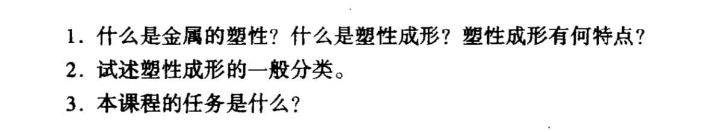

# 塑性成形原理复习要点

# 

应力分析：掌握主应力、主方向、主平面、应力张量不变量、工艺塑性概念；判别两个应力状态是否相同及工艺塑性的好坏；应力应力张量分解为应力偏张量和应力球张量；等效 应力；求某切面 $\mathrm{1{=}m{=}0.5}$ 上的全应力、正应力和剪应力；求解主应力和主方向；莫尔圆图解法；应力平衡微分方程的运用。

应变分析：塑性变形时金属体积不变应变条件，泊松比；工程剪应变、应力张量中的剪应变分量；给定应变张量，试将其分解为应变偏张量和应变球张量；等效应变；给定位移函 数，求应变张量；变形连续方程的应用；判断该应变状态能否存在。

屈服准则：屈服准则概念及相关材料：两个屈服准则：塑性或弹性状态的判断：薄壁圆简和薄壁球壳求内压：圆柱体压缩过程中载荷-坏料高度之间的关系：属服准则几何描述及其实验验证。

本构关系：增量理论；三个本构方程名称及应用范围；薄壁球壳、薄壁圆筒胀行时经向、纬向、径向应变增量的比值。←

主应力法：主应力法的假设：计算平面应变镦粗的变形力：计算圆柱体镦粗的变形力。注意：不要死记硬背，要理解记忆，平时习题和作业很重要。
