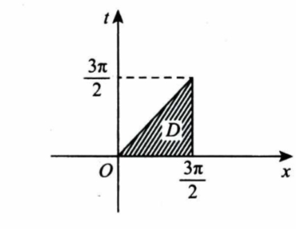

# 16

$\text{(3)反常积分 1}\int_{-\infty}^{0}\frac{1}{x^{2}}\mathrm{e}^{\frac{1}{x}}\mathrm{d}x,2\int_{0}^{+\infty}\frac{1}{x^{2}}\mathrm{e}^{\frac{1}{x}}\mathrm{d}x\text{的敛散性为}($

$(B)\textcircled{1}收敛,2发散.$

$\text{因为}\int_{-\infty}^0\frac1{x^2}\mathrm{e}^{\frac1x}\mathrm{d}x=-\left.\mathrm{e}^{\frac1x}\right|_{-\infty}^0=-\left(0-1\right)=1$

$\int_{0}^{+\infty} \frac{1}{x^{2}}\mathrm{e}^{\frac{1}{x}} \mathrm{d}x=-\mathrm{e}^{\frac{1}{x}} \biggr|_{0}^{+\infty}=+\infty$

$\int_{-\infty}^{0}\frac{1}{x^{2}}\mathrm{e}^{\frac{1}{x}}\mathrm{d}x=\int_{-\infty}^{0}\mathrm{e}^{\frac{1}{x}}\mathrm{d}\Big(-\frac{1}{x}\Big)=- \mathrm{e}^{\frac{1}{x}}\Big|_{-\infty}^{\circ}=1,\text{收敛}$

$(7)\text{ 设}A,B\text{ 是可逆矩阵},\text{且}A\text{ 与 }B\text{ 相似},\text{则下列结论错误的是}($

$A +A^{\mathrm{T}} \text{与} B + B^{\mathrm{T}} \text{相似}$

$P^{-1}(A+A^{\top})P=P^{-1}AP+P^{-1}A^{\top}P,\quad P^{-1}AP=B,$

$而P^{-1}A^{\mathrm{T}}P未必等于B^{\mathrm{T}}$

$(11)以y=x^2-\mathrm{e}^x\text{和}y=x^2\text{为特解的一阶非齐次线性微分方程为}$

$\text{由线性微分方程解的结构得 }y_2-y_1=\mathrm{e}^x\text{ 为 }y^{\prime}+p(x)y=0\text{ 的解 },\text{代人得 }p(x)=-1,$

$\text{将 }y_2=x^2\text{ 代人 }y^{\prime}-y=q(x)\text{ 得 }q(x)=2x-x^2$

$(13)\text{ 已知动点 }P\text{在曲线 }y=x^3\text{ 上运动},\text{记坐标原点与点}P\text{间的距离为}l.\text{ 若点 }P\text{的横坐标对时间的}\\\text{变化率为常数 }v_0,\text{则当点 }P\text{ 运动到点}(1,1)\text{ 时},l\text{ 对时间的变化率是}$

$\text{设 }t\text{ 时刻 }P\text{ 点的坐标为}(x(t),y(t)),l=\sqrt{x^2(t)+y^2(t)}=\sqrt{x^2(t)+x^6(t)}$

$\frac{\mathrm{d}l}{\mathrm{d}t}=\frac{2x\left(t\right)+6x^5\left(t\right)}{2\sqrt{x^2\left(t\right)+x^6\left(t\right)}}\cdot\frac{\mathrm{d}x}{\mathrm{d}t}$

$\text{取 }x\left(t\right)=1,\frac{\mathrm{d}x}{\mathrm{d}t}=v_0,\text{则}\frac{\mathrm{d}l}{\mathrm{d}t}=\frac{8}{2\sqrt{2}}\bullet v_0=2\sqrt{2} v_0.$

15）

$A=\lim_{x\to0}\frac{\ln(\cos2x+2x\sin x)}{x^4}$

$=\lim_{x\to0}\frac{1-\frac{1}{2}(2x)^{2}+\frac{1}{24}(2x)^{4}+o(x^{4})+2x\biggl[x-\frac{1}{6}x^{3}+o(x^{3})\biggr]-1}{x^{4}}=\frac{1}{3}$

$(16)(本题满分10分)\\\text{设函数}f( x ) = \int_{0}^{1} | t^{2} - x^{2} | \mathrm{d}t( x > 0) , \text{求}f^{\prime}( x ) , \text{并求} f( x ) \text{的最小值}.$

$当0<x\leqslant1时$

$f(x)=\int_{0}^{x}\mid t^{2}-x^{2}\mid\mathrm{d}t+\int_{x}^{1}\mid t^{2}-x^{2}\mid\mathrm{d}t$

$=\int_{0}^{x}(x^{2}-t^{2})\mathrm{d}t+\int_{x}^{1}(t^{2}-x^{2})\mathrm{d}t=\frac{4}{3}x^{3}-x^{2}+\frac{1}{3}$

$x>1$

$f(x)=\int_0^1(x^2-t^2) \mathrm{d}t=x^2-\frac{1}{3}.$

$f_{-}^{\prime}(1)=\lim_{x\to1^{-}}\frac{\frac{4}{3}x^{3}-x^{2}+\frac{1}{3}-\frac{2}{3}}{x-1}=2$

$f'(x)=\begin{cases}4x^2-2x,&0<x\leqslant1,\\2x,&x>1.\end{cases}$

$\text{由 }f^{\prime}(x)=0\text{ 解得唯一驻点 }x=\frac{1}{2},\text{又 }f^{\prime\prime}\Big(\frac{1}{2}\Big)>0,\text{从而 }x=\frac{1}{2}\text{ 为 }f(x)\text{ 的最小值点},\text{最小值为}\frac{1}{4}$

## S

$S=2\pi\int_0^{\frac{\pi}{2}}|y|\sqrt{x^{'2}(t)+y^{'2}(t)} \mathrm{d}t$

$\begin{aligned}&\text{(21)(本题满分11分)}\\&\text{已知两数}f(x)\text{ 在}\left[0,\frac{3\pi}{2}\right]\text{上连续},\text{在}\left(0,\frac{3\pi}{2}\right)\text{内是函数}\frac{\cos x}{2x-3\pi}\text{的一个原两数},\text{且}f(0)=0.\end{aligned}$

$(\begin{array}{c}1\end{array})\text{求}f(x)\text{在区间}\left[0,\frac{3\pi}{2}\right]\text{上的平均值};$

$(\text{II)证明}f(x)\text{在区间}\Big(0,\frac{3\pi}{2}\Big)\text{内存在唯一零点}.$

$\overline{f}=\frac{2}{3\pi}\int_{0}^{\frac{3\pi}{2}}f(x)\mathrm{d}x=\frac{2}{3\pi}\int_{0}^{\frac{3\pi}{2}}\Big(\int_{0}^{x}\frac{\cos t}{2t-3\pi}\mathrm{d}t\Big)\mathrm{d}x$

$=\frac{2}{3\pi}\int_{0}^{\frac{3\pi}{2}}\mathrm{d}t\int_{t}^{\frac{3\pi}{2}}\frac{\cos t}{2t-3\pi}\mathrm{d}x=-\frac{1}{3\pi}\int_{0}^{\frac{3\pi}{2}}\cos t\mathrm{d}t=\frac{1}{3\pi}.$

$\text{由题意,得}f^{'}(x)=\frac{\cos x}{2x-3\pi},x\in\Big(0,\frac{3\pi}{2}\Big).$

$\begin{aligned}&\text{当 }0<x<\frac{\pi}{2}\text{ 时,因为 }f^{\prime}(x)<0,\text{所以 }f(x)<f(0)=0,\text{故 }f(x)\text{ 在}\left(0,\frac{\pi}{2}\right)\text{内无零点,且}f\left(\frac{\pi}{2}\right)<0.\\&\text{由积分中值定理知,存在 }x_{0}\in\left[0,\frac{3\pi}{2}\right],\text{使得 }f(x_{0})=\overline{f}=\frac{1}{3\pi}>0,\text{由于当 }x\in\left(0,\frac{\pi}{2}\right]\text{时},f(x)<0,\text{所以}\\&x_{0}\in\biggl(\frac{\pi}{2},\frac{3}{2}\pi\biggr].\end{aligned}$

$\begin{aligned}&\text{根据连续函数介值定理知,存在 }\xi\in\left(\frac\pi2,x_0\right)\subset\left(\frac\pi2,\frac{3\pi}2\right),\text{使得 }f(\xi)=0.\text{ 又因为当}\frac\pi2<x<\frac{3\pi}2\text{时},\\&f^{\prime}(x)>0,\text{所以 }f(x)\text{ 在}\left(\frac\pi2,\frac{3\pi}2\right)\text{内至多只有一个零点}.\end{aligned}$

$\text{综上所述},f(x)\text{ 在}\left(0,\frac{3\pi}2\right)\text{内存在唯一的零点}.$

$\begin{aligned}&\text{已知矩阵 }A = \begin{pmatrix}0&-1&1\\2&-3&0\\0&0&0\end{pmatrix}.\\&(\textbf{I})\text{ 求}A^{99};\end{aligned}$

$\begin{aligned}&(\text{ II })\text{ 设 3 阶矩阵 }B=(\alpha_1,\alpha_2,\alpha_3)\text{ 满足 }B^2=BA.\text{ 记 }B^{100}=(\beta_1,\beta_2,\beta_3),\text{将}\beta_1,\beta_2,\beta_3\text{ 分别}\\&\text{表示为 }\alpha_1,\alpha_2,\alpha_3\text{ 的线性组合}.\end{aligned}$

$\mid\lambda\boldsymbol{E}-\boldsymbol{A}\mid=\begin{vmatrix}\lambda&1&-1\\-2&\lambda+3&0\\0&0&\lambda\end{vmatrix}=\lambda(\lambda+1)(\lambda+2)$

$\boldsymbol{P}=(\boldsymbol{\xi}_1,\boldsymbol{\xi}_2,\boldsymbol{\xi}_3)=\begin{bmatrix}1&1&3\\1&2&2\\0&0&2\end{bmatrix},\text{则 }\boldsymbol{P}^{-1}\boldsymbol{AP}=\begin{bmatrix}-1&&\\&-2&\\&&0\end{bmatrix}$

$\mathbf{A}^{99}=\mathbf{P}\begin{pmatrix}(-1)^{99}&&\\&(-2)^{99}&\\&&0\end{pmatrix}\mathbf{P}^{-1}$

$=\begin{bmatrix}1&1&3\\1&2&2\\0&0&2\end{bmatrix}\begin{bmatrix}(-1)^{99}&&\\&(-2)^{99}&\\&&0\end{bmatrix}\begin{bmatrix}2&-1&-2\\\\-1&1&\frac{1}{2}\\\\0&0&\frac{1}{2}\end{bmatrix}$

$=\begin{bmatrix}1&1&3\\1&2&2\\0&0&2\end{bmatrix}\begin{bmatrix}(-1)^{99}&&\\&(-2)^{99}&\\&&0\end{bmatrix}\begin{bmatrix}2&-1&-2\\\\-1&1&\frac{1}{2}\\\\0&0&\frac{1}{2}\end{bmatrix}$

$(\coprod)因为B^2=BA,所以$

$B^{100}=B^{98}B^{2}=B^{99}A=B^{97}B^{2}A=B^{98}A^{2}=\cdots=BA^{99}$

$(\beta_1,\beta_2,\beta_3)=(\alpha_1,\alpha_2,\alpha_3)\begin{bmatrix}2^{99}-2&1-2^{99}&2-2^{98}\\2^{100}-2&1-2^{100}&2-2^{99}\\0&0&0\end{bmatrix}.$

$\begin{cases}\boldsymbol{\beta}_1=(2^{99}-2)\boldsymbol{\alpha}_1+(2^{100}-2)\boldsymbol{\alpha}_2,\\\boldsymbol{\beta}_2=(1-2^{99})\boldsymbol{\alpha}_1+(1-2^{100})\boldsymbol{\alpha}_2,\\\boldsymbol{\beta}_3=(2-2^{98})\boldsymbol{\alpha}_1+(2-2^{99})\boldsymbol{\alpha}_2.\end{cases}$
