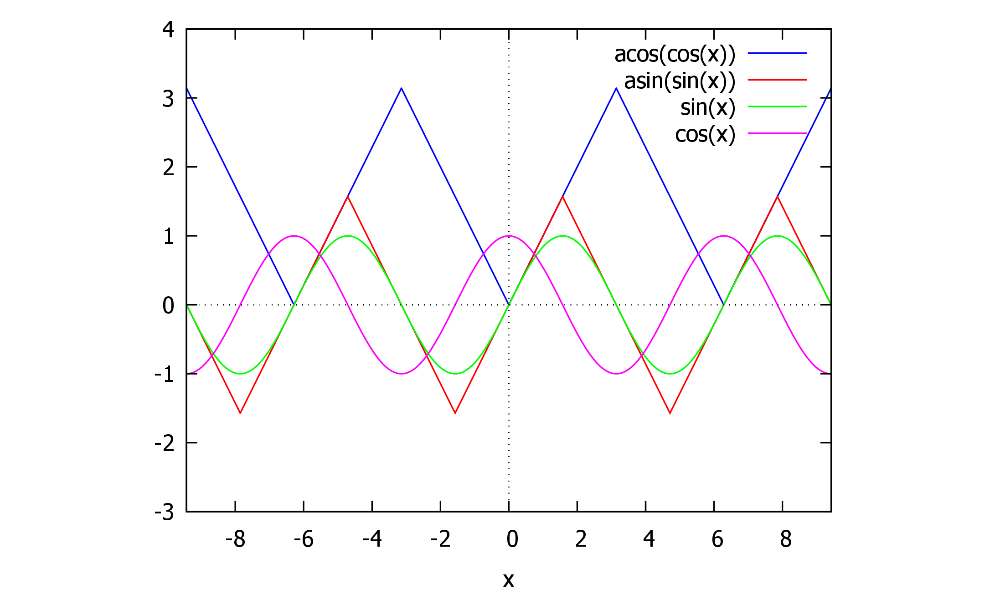

## 目录

1first [2](#auto-1)

1.1和差化积 [3](#auto-2)

1.2♥some easy replace [4](#auto-3)

2线性表出 [4](#auto-4)

2.1线性相关 [5](#auto-5)

3两个方程同解 [7](#auto-6)

3.1已知特征值，求特征向量 ♥ [9](#auto-7)

3.2\[分析\]矩阵的对角化： [9](#auto-8)

4A; 特征值；求可逆矩阵P ，相应的对角矩阵 $\Lambda$ [10](#auto-9)

4.1实对称矩阵A（含参数），求可逆矩阵P，求对角矩阵$\Lambda$
[10](#auto-10)

4.2实对称矩阵的正交规范化 [11](#auto-11)

4.3$f(A)$的特征值 及对应的特征向量 [11](#auto-12)

4.3.1实对称矩阵必可对角化 [11](#auto-13)

5最最最易错的分解 [12](#auto-14)

5.1$\frac{x^{2} + c}{(x + a)(x + b)^{2}}$ [12](#auto-15)

5.2arccos的区间 [15](#auto-16)

6A的行列变换 [18](#auto-17)

7方程组同解 [19](#auto-18)

8函数极限 [21](#auto-19)

8.1复合函数 [21](#auto-20)

9数列极限 [22](#auto-21)

9.1极限存在证明 [22](#auto-22)

10连续与可导 [23](#auto-23)

11\|A\| [23](#auto-24)

11.1克拉默法则 [24](#auto-25)

12方程实根数 [24](#auto-26)

12.1分情况讨论 [25](#auto-27)

12.2参数分离 [25](#auto-28)

13绝对值\|X\| [27](#auto-29)

14中值定理 [27](#auto-30)

15已知两个方程组的通解，求公共解。 [28](#auto-31)

16sinx与cosx [29](#auto-32)

17微分方程 [29](#auto-33)

17.1二阶，少y [30](#auto-34)

17.2$y(x) = u(x)g(x)$的二阶微分方程 [30](#auto-35)

17.3一个简单的倒带换 [31](#auto-36)

17.4高阶K重根 [32](#auto-37)

18定积分应用 [32](#auto-38)

18.1旋转体体积，非$y轴,V_{} = V_{1} - V_{2}$ [32](#auto-39)

18.2积分比大小 [32](#auto-40)

19重积分 [33](#auto-41)

19.1分段区间 [33](#auto-42)

19.2区间相同，二重积分保序性 [34](#auto-43)

19.3二重积分存在 [35](#auto-44)

20积分表 [?](#auto-45)

## 1first

\[题目\]
设$n$阶可逆矩阵$A$有特征值$\lambda$,对应的特征向量为$\mathbf{\alpha}$,证明$\mathbf{\alpha}$也是$A^{-}1$对应于$\lambda^{- 1}$的特征向量

\[证明\]
由题设$A\mathbf{\alpha} = \lambda\mathbf{\alpha}$,两边同乘$A^{-}1$,则

$\left. \ \left( A^{- 1}A \right)\mathbf{\alpha} = \lambda\left( A^{- 1}\mathbf{\alpha} \right) \Rightarrow E\mathbf{\alpha} = \lambda\left( A^{- 1}\mathbf{\alpha} \right) \Rightarrow \mathbf{\alpha} = \lambda\left( A^{- 1}\mathbf{\alpha} \right) \right.\ $
因为$A$可逆，则$|A| \neq 0$. 由$|A|$等于特征值之积，故$\lambda \neq 0$.
综上，$A^{- 1}\mathbf{\alpha} = \frac{1}{\lambda}\mathbf{\alpha}$.
故$\alpha$也是$A^{-}1$对应于$\lambda^{- 1}$的特征向量。

$A^{- 1}\alpha = \frac{1}{\lambda}\alpha$

$A = \alpha\alpha^{T}A\alpha = \alpha\left( \alpha^{T}\alpha \right)$

$\alpha\alpha^{t} = k$

### 1.1和差化积

和差化积公式：sin$(\alpha) + \sin(\beta) = 2\sin\left( \frac{\alpha + \beta}{2} \right)\cos\left( \frac{\alpha - \beta}{2} \right)$

$\sin(\alpha) + \sin(\beta) = 2\sin\left( \frac{\alpha + \beta}{2} \right)\cos\left( \frac{\alpha - \beta}{2} \right)\sin(\alpha) - \sin(\beta) = 2\cos\left( \frac{\alpha + \beta}{2} \right)\sin\left( \frac{\alpha - \beta}{2} \right)\cos(\alpha) + \cos(\beta) = 2\cos\left( \frac{\alpha + \beta}{2} \right)\cos\left( \frac{\alpha - \beta}{2}）. \right.\ \cos(\alpha) - \cos(\beta) = - 2\sin\left( \frac{\alpha + \beta}{2} \right)\sin\left( \frac{\alpha - \beta}{2} \right)$

\[帮助记忆\]

方法
1.可以只记第一个公式，将其它公式用诱导公式化成$\sin(\alpha) + \sin(\beta)$的形式。
方法 2.找规律。前两个公式是
$\sin$和$\cos$异名函数乘积，后两个公式是同名函数乘积。

口诀：

正加正，正在前，

余加余，余并肩。

正减正，余在前，

余减余，负正弦。

### 1.2♥some easy replace

$\begin{matrix}
 & x \in (0, + \infty)\text{时,有}0 < \frac{x}{x + 1} < \ln(x + 1).\text{故}\frac{x^{3}}{x + 1} < \ln(x + 1)x^{2}. \\
 & \text{故}\int_{0}^{1}\frac{x^{3}}{x + 1}\text{d}x < \int_{0}^{1}\ln(x + 1)x^{2}\text{d}x,\text{即}I_{2} < I_{1}. \\
 & \text{故选}A.
\end{matrix}$

\<\|\|

+-----------------------------------+-----------------------------------+
| (%i14)                            |     tm_plo                        |
|                                   | t2d([log(1+t),t/(1+t)],[t,0,0.5]) |
+-----------------------------------+-----------------------------------+

{width="5.833333333333333in"
height="3.4995614610673664in"}$\text{(}\text{\%o14}\text{)
     ~}\text{true}$

\>

## 2线性表出

\[2003年真题\]设向量组$I$:$\alpha_{1},\alpha_{2},\ldots\ldots,\alpha_{t}$可由向量组$II:\beta_{1},\beta_{2},\ldots\ldots\beta_{s}$线性表示，则

$\mathcal{A}$. 当$t < s$时，向量组$II$必线性相关

B. 当$t > s$时，向量组$II$必线性相关

$\mathbb{C}$. 当$t < s$时，向量组$I$ 必线性相关

D. 当$t > s$时，向量组$I$必线性相关

\[简解\]
根据定理：\"若$\alpha_{1},\alpha_{2},\cdots,\alpha_{t}$可有$\beta_{1},\beta_{2},\cdots,\beta_{s}$线性表出，且$t > s$,则$\alpha_{1},\alpha_{2},\cdots,\alpha_{t}$必线性相关

即若多数向量可以由少数向量线性表出，则此多数向量必线性相关，故选 D.

若$A$ 为$m \times n$ 矩阵，则以下哪个选项是正确的？

A.
若$n > m$,由$A$的行秩是行极大线性无关组的向量个数$\leq$行向量组的总向量个数$= m$,则$r(A) = m$
B.
由$A$的行秩是行极大线性无关组的向量个数=行向量组的总向量个数$= m$,则$r(A) \leq m$
$\mathbb{C}.A$的列秩是列极大线性无关组的向量个数=列向量组的总向量个数$= n$,则$r(A) = n$
D.
$A$的列秩是列极大线性无关组的向量个数$\leq$列向量组的总向量个数$= n$,则$r(A) \leq n$

因为$r(A) = A$的行秩$= A$的列秩，
而$A$的列秩是列极大线性无关组的向量个数$\leq$列向量组的总向量个数$= n$.
同理$A$的行秩是行极大线性无关组的向量个数$\leq$行向量组的总向量个数$= m$.
综上，$r(A) \leq$ min $(m,n)$,即有$r(A) \leq n$. 选D.

其余选项：

$\mathbb{A}$:只能得出$r(A) \leq m$.

B:$A$的行秩是行极大线性无关组的向量个数$\leq$行向量组的总向量个数$= m$

### 2.1线性相关

由特征值的定义

有$\left\lbrack A\left( \lambda_{2}\alpha_{1} \right),A\left( \lambda_{1}\alpha_{2} \right) \right\rbrack = \left\lbrack \lambda_{1}\lambda_{2}\alpha_{1},\lambda_{1}\lambda_{2}\alpha_{2} \right\rbrack$
极大线性无关组中所含向量的个数$r$称为向量组的秩，因此需判定$\left\lbrack \lambda_{1}\lambda_{2}\alpha_{1},\lambda_{1}\lambda_{2}\alpha_{2} \right\rbrack$中的线性无关向量。

由互不相同的特征值对应的特征向量线性无关，则$\alpha_{1}$与$\alpha_{2}$线性无关。

当$\left. \ \lambda_{1} \neq 0,\lambda_{2} \neq 0 \Rightarrow \lambda_{1}\lambda_{2} \neq 0 \right.\ $,则$\lambda_{1}\lambda_{2}\alpha_{1} \neq 0,\lambda_{1}\lambda_{2}\alpha_{2} \neq 0$,
故$\lambda_{1}\lambda_{3}\alpha_{1}$与$\lambda_{1}\lambda_{3}\alpha_{3}$线性无关，向量组$A\left( \lambda_{2}\alpha_{1} \right),A\left( \lambda_{1}\alpha_{3} \right)$的秩为
2.

♥$\alpha_{1}$ 和 $A\left( \alpha_{1} + \alpha_{2} \right)$ 线性无关
$\left. \  \Leftrightarrow r\left( \alpha_{1},\lambda_{1}\alpha_{1} + \lambda_{2}\alpha_{2} \right) = 2 \right.\ $。
这是因为 $\alpha_{1}$ 和 $\alpha_{2}$
是不同特征值的特征向量，所以它们线性无关，即
$r\left( \alpha_{1},\alpha_{2} \right) = 2$。要使
$r\left( \alpha_{1},\lambda_{1}\alpha_{1} + \lambda_{2}\alpha_{2} \right) = 2$，必须保证
$\lambda_{2} \neq 0$，这样矩阵 $\begin{bmatrix}
1 & \lambda_{1} \\
0 & \lambda_{2}
\end{bmatrix}$ 的秩才能为 2。Z

♥
设$A = \left( \alpha_{1},\alpha_{2},\alpha_{3} \right)$是三阶矩阵，$A^{*}$为$A$的伴随矩阵，若$(0,2,1)^{\text{T}}$是方程组$A\text{x} = 0$的一个基础解系，则$A^{*}\text{x} = 0$的基础解系可为

$\begin{matrix}
\text{A.} & \alpha_{1}
\end{matrix}$ $B$. $\alpha_{1},\alpha_{2}$ $C$. $\alpha_{2},\alpha_{3}$
$\mathcal{D}$. $\alpha_{1},\alpha_{2},\alpha_{3}$

\[分析\]没有具体的线性方程组，先用秩来决定线性无关解的个数，再用$AB = O$
来得到解向量。

\[解答\] 用秩来决定线性无关解的个数： 因为$A\text{x} = 0$ 只有 1
个线性无关的解，即 $n - r(A) = 1,n = 3$,从而 $r(A) = 2$.
$由r(A) = 2 = n - 1,则r\left( A^{*} \right) = 1$.
有$n - r\left( A^{*} \right) = 3 - 1 = 2$,故$A^{*}\text{x} = 0$的基础解系中有
2 个线性无关的解向量。

用$AB = O$来得到解向量： $由A\text{x} = 0$有非零解，则$|A| = 0$.
由$A^{*}A = |A|E$,及$|A| = 0$,有$A^{*}A = O$,则$A$
的列向量全是$A^{*}\text{x} = 0$ 的解。

而秩$r(A) = 2$,故$A$的列向量中必有 2 个线性无关。 需找到这 2
个线性无关的列向量：

综上，$\alpha_{1},\alpha_{2}$无关，$\alpha_{1},\alpha_{3}$无关。 选B.

♥\[2011年真题)设$A = \left( \alpha_{1},\alpha_{2},\alpha_{3},\alpha_{4} \right)$
是四阶矩阵，$A^{*}$为$A$ 的伴随矩阵，若 $(1,0,1,0)^{\text{T}}$ 是方程组
$A\text{x} = 0$ 的一个基础解系，则

$A^{*}\text{x} = 0$的基础解系可为

$A$. $\alpha_{1},\alpha_{3}$ $\begin{matrix}
B. & \alpha_{1},\alpha_{2}
\end{matrix}$ $\begin{matrix}
C. & \alpha_{1},\alpha_{2},\alpha_{3}
\end{matrix}$ $\mathcal{D}$. $\alpha_{2},\alpha_{3},\alpha_{4}$

\[分析\]没有具体的线性方程组，先用秩来决定线性无关解的个数，再用$AB = O$
来得到解向量。

\[解答\] 用秩来决定线性无关解的个数： 因为$A\text{x} = 0$**只有 1**
个线性无关的解，即$n - r(A) = 1,n = 4$,从而$r(A) = 3$. $由$
$r(A) = 3 = n - 1,则$ $r\left( A^{*} \right) = 1$.
有$n - r\left( A^{*} \right) = 4 - 1 = 3$,故$A^{*}\text{x} = 0$
的基础解系中有 **3 个线性无关的解向量**。 用$AB = O$来得到解向量：
由$A\text{x} = 0$ 有非零解，则 $|A| = 0$.
由$A^{*}A = |A|E$,及$|A| = 0$,有$A^{*}A = O$.则$A$
的列向量全是$A^{*}\text{x} = 0$ 的解。
而秩$r(A) = 3$,故$A$的列向量中必有 3 个线性无关。

综上，$\alpha_{2},\alpha_{3},\alpha_{4}$无关。

选D.

## 3两个方程同解

线性无关的解的个数相同=\>系数矩阵的秩相同

基础解系相同

由 方 程 组 同 解 , 则 $n - r(B) =$ 方 程 ( ll) 线 性 无 关 解 的 个 数
= 方 程 ( l) 线 性 无 关 解 的 个 数 = 方 程 ( l) 线 性 无 关 解 的 个
数 $= n - r(A)$, 即 $r(B) = r(A)$. 因 为 $r(B) \leq 2$,则
$r(A) \leq 2$,即 $|A| = 0$, 有

$\begin{matrix}
1 & 3 & 3 \\
2 & 4 & 6 \\
1 & a & 1
\end{matrix} = \left| \begin{matrix}
1 & 3 & 3 \\
0 & - 2 & - 4 \\
0 & - 1 & 0
\end{matrix} \right| = 4(a - 1) = 0$,则$a = 1$.

$AΒ = Or(A) + r(B) \leq \min\left\{ r(A),r(B) \right\}$

由于$A,B$均非零，故$r(A) > 0$,且$r(B) > 0$,即$r(A) \geq 1,r(B) \geq 1$.
由于$AB = O$,且$A$ 是$5 \times 4,B$ 是$4 \times 6$ 矩阵，则
$r(A) + r(B) \leq 4$.
代入$r(A) \geq 1$,有$r(B) \leq 4 - r(A) \leq 3$.因为已得出$r(B) \geq 1$,则$1 \leq r(B) \leq 3$.

$过D$.

AB=O时的秩:若 A是 m×n矩阵,B是 n×s矩阵,AB=O,则 r(A)+r(B)≤n.

已知
α~1~,α~2~,α~3~线性无关,则\[α~1~,α~2~,α~3~\]可逆,又有Aα~1~,Aα~2~,Aα~3~的表达式,想到相似,即AP=PB⇔P^-1^AP=B.

$12345$

$\left. \ 列向量线性无关，可逆，AP = PB \Leftrightarrow P^{- 1}AP = B \right.\ $

$A \sim B;A_{\lambda} = B_{\lambda}$

$|\lambda E - A| = O$

### 3.1

已知特征值，求特征向量 ♥

$\left. \ \lambda \rightarrow A,系数矩阵，行最简形矩阵，自由未知量x_{x} = 1,0；得到基础解系即属于特征值\lambda_{x}的特征向量 \right.\ $

\- 代入每个 λ~i~,得到线性方程组 (λ~i~E-A)**x**=0,通解即对应
λ~i~的全体特征向量(除去 0向量)

\-

\-

\-

$1.当\lambda_{1} = \lambda_{2} = 1时，由(E - B)\text{x} = 0$,系数矩阵$\left. \ E - B = \begin{bmatrix}
0 & 0 & 0 \\
 - 1 & - 1 & - 2 \\
 - 1 & - 1 & - 2
\end{bmatrix} \rightarrow \begin{bmatrix}
1 & 1 & 2 \\
0 & 0 & 0 \\
0 & 0 & 0
\end{bmatrix} \right.\ $ 令 $x_{2},x_{3}$ 为 自 由 未 知 量 , $x_{1}$ 为
独 立 未 知 量 。 令 $x_{2},x_{3}$ 为 自 由 未 知 量 , $x_{1}$ 为 独 立
未 知 量 。 令 $x_{2} = 1,x_{3} = 0$,则 $x_{1} = - 1$. 令
$x_{2} = 0,x_{3} = 1$,则 $x_{1} = - 2$.
故$\eta_{1} = ( - 1,1,0)^{T},\eta_{2} = ( - 2,0,1)^{T}$
是一个基础解系，即属于特征值$\lambda_{1} = \lambda_{2} = 1$
的两个线性无关的特征向量。
2.当$\lambda_{3} = 4$时，由$(4E - B)\text{x} = 0$,系数矩阵
$\left. \ 4E - B = \begin{bmatrix}
3 & 0 & 0 \\
 - 1 & 2 & - 2 \\
 - 1 & - 1 & 1
\end{bmatrix} \rightarrow \begin{bmatrix}
1 & 0 & 0 \\
0 & 1 & - 1 \\
0 & 0 & 0
\end{bmatrix} \right.\ $ 令$x_{3}$ 为自由未知量，$x_{1},x_{2}$
为独立未知量。
令$x_{3} = 1$,则$x_{2} = 1,x_{1} = 0$.故$\eta_{3} = (0,1,1)^{\text{T}}$
是一个基础解系，即属于特征值 $\lambda_{3} = 4$ 的一个特征向量。
综上，$\eta_{1},\eta_{2},\eta_{3}$为三个线性无关的特征向量。 选$D$.

### 3.2\[分析\]矩阵的对角化：

令$A$的特征值为$\lambda_{1},\lambda_{2},\cdots,\lambda_{n}$,设$A$有$n$个线性无关的特征向量$\mathbf{\alpha}_{1},\mathbf{\alpha}_{2},\cdots,\mathbf{\alpha}_{n}$
,

取$P = \left\lbrack \alpha_{1},\alpha_{2},\cdots,\alpha_{n} \right\rbrack$,则有$P^{- 1}AP = \Lambda$,其中$\Lambda = \begin{bmatrix}
\lambda_{1} & & & \\
 & \lambda_{2} & & \\
 & & \ddots & \\
 & & & \lambda_{n}
\end{bmatrix}$.

\[解答\]
注意$P$的每一列为一个特征向量，且$P$中$\mathbf{\alpha}_{1},\mathbf{\alpha}_{2},,\mathbf{\alpha}_{n}$
排列次序应与 $\Lambda$ 中 $\lambda_{1},\lambda_{2},,\lambda_{n}$
的排列次序 一致。

\<with\|color\|red\|\[解答\]\>

## 4

A; 特征值；求可逆矩阵P ，相应的对角矩阵 $\Lambda$

\[1999年真题\]设矩阵$A = \begin{bmatrix}
3 & 2 & - 2 \\
0 & - 1 & 0 \\
4 & 2 & - 3
\end{bmatrix}$,已知$A$ 的特征值

为1，-1,-1.求可逆矩阵$P$,使得$P^{- 1}AP = \Lambda$为对角矩阵？

并求出相应的对角矩阵。

### 4.1实对称矩阵A（含参数），求可逆矩阵P，求对角矩阵$\Lambda$

\[2002年真题 设实对称矩阵$A = \left| \begin{matrix}
a & 1 & 1 \\
1 & a & - 1 \\
1 & - 1 & a
\end{matrix} \right|$,求可逆矩阵$P$,使$P^{- 1}AP$为对角阵。

$|\lambda E - A| = O$;求特征值 $\lambda_{n}\Lambda$
✓;代入A，化最简阶梯形矩阵，自由未知数$X_{n}$:q1$\rightarrow$得到基础解系$(特征向量)$
$P$

$\begin{matrix}
 & \text{1. 求特征值:} \\
 & \text{立特征方程:}|\lambda E - A| = \left| \begin{matrix}
\lambda - a & - 1 & - 1 \\
 - 1 & \lambda - a & 1 \\
 - 1 & 1 & \lambda - a
\end{matrix} \right| = \left| \begin{matrix}
\lambda - a - 1 & \lambda - a - 1 & 0 \\
 - 1 & \lambda - a & 1 \\
0 & a + 1 - \lambda & \lambda - a - 1
\end{matrix} \right| \\
 & = (\lambda - a - 1)^{2}\left| \begin{matrix}
1 & 1 & 0 \\
 - 1 & \lambda - a & 1 \\
0 & - 1 & 1
\end{matrix} \right| = (\lambda - a - 1)^{2}\left| \begin{matrix}
1 & 1 & 0 \\
0 & \lambda - a + 1 & 1 \\
0 & - 1 & 1
\end{matrix} \right| \\
 & = (\lambda - a - 1)^{2}(\lambda - a + 2)
\end{matrix}$

### 4.2实对称矩阵的正交规范化

对矩阵 $A$ 执行特征值分解。

\- 将得到的特征向量作为矩阵 $Q$ 的列。

\- 对 $Q$ 的每一列向量 $q_{i}$
执行归一化：$q_{i} = \frac{q_{i}}{\left. \parallel q_{i} \right.\parallel}$，其中
$\left. \parallel q_{i} \right.\parallel$ 是向量 $q_{i}$
的欧几里得范数。

### 4.3$f(A)$的特征值 及对应的特征向量

  -------------- -------------- -------------- -------------- --------------
       矩阵            A              kA            A^k^           f(A)

                                                              

      特征值           λ              kλ            λ^k^           f(λ)

                                                              

   对应特征向量        α              α              α              α
  -------------- -------------- -------------- -------------- --------------

$A的特征值已知?f(A)的特征值是?对应的特征向量变了吗?/$

相似矩阵的性质 对应的特征向量是变的.

  ----------------- ----------------- ----------------- -----------------
        矩阵              A^-1^             A^\*^          A^-1^+f(A)

                                                        

                                                        

       特征值             λ^-1^          \|A\|λ^-1^        λ^-1^+f(λ)

                                                        

                                                        

    对应特征向量            α                 α                 α
  ----------------- ----------------- ----------------- -----------------

  ----------------------- -------------- -------------- --------------------- --------------
   运用相似矩阵的性质,有                                 $B = P^{- 1}A^{*}P$  

           矩阵           A              A^\*^                    B           B+kE

                                                                              

          特征值          λ              \|A\|λ^-1^          \|A\|λ^-1^       \|A\|λ^-1^+k

                                                                              

       对应特征向量       α              α                     P^-1^α         P^-1^α
  ----------------------- -------------- -------------- --------------------- --------------

#### 4.3.1实对称矩阵必可对角化

$\left. \ A与B(实对称矩阵)相似的充分必要条件isA和B的特征值相同 \rightarrow \left| \lambda_{b_{n}}E - A \right| = O \right.\ $

## 5最最最易错的分解

### 5.1$\frac{x^{2} + c}{(x + a)(x + b)^{2}}$

有理分式：分母能因式分解，含二次式的高次幂，则拆成分子为一次式的项

$\frac{x^{2} - 2x + 2}{\left( 2 + x^{2} \right)^{2}} = \frac{Ax + B}{2 + x^{2}} + \frac{Cx + D}{\left( 2 + x^{2} \right)^{2}}.$

∫e^x^⋅

  -----------------------------------------------------------------------
  x^2^-2x+2

  (2+x^2^)^2^
  -----------------------------------------------------------------------

dx

+-----------------------------------+-----------------------------------+
|     (dbm:17.)                     |     kill(all)                     |
+-----------------------------------+-----------------------------------+

$done$

+-----------------------------------+-----------------------------------+
|     (dbm:18.)                     |     eq1:x2-2⁢x+2(2+x2)2;           |
+-----------------------------------+-----------------------------------+

$\frac{x^{2}. - 2.x + 2.}{\left( x^{2}. + 2. \right)^{2}.}$

+-----------------------------------+-----------------------------------+
|     (dbm:18.)                     |     eq2:a⁢x+b2+x2+c⁢x+d(2+x2)2      |
+-----------------------------------+-----------------------------------+

$\frac{ax + b}{x^{2}. + 2.} + \frac{cx + d}{\left( x^{2}. + 2. \right)^{2}.}$

+-----------------------------------+-----------------------------------+
|     (dbm:18.)                     |                                   |
|                                   |    solve(eq1-eq2=0,[a=-23,b,c,d]) |
+-----------------------------------+-----------------------------------+

$\left\lbrack \left\lbrack a = - \left( \frac{2.}{3.} \right) = \% R26,b = \% R28,c = \% R27,d = - \left( ax^{3}. \right) + (1. - \% R28)x^{2}. + \left( - (2.a) - \% R27 - 2. \right)x - 2.\% R28 + 2. \right\rbrack \right\rbrack$

+-----------------------------------+-----------------------------------+
|     (dbm:18.)                     |     eq1: 'f                       |
|                                   | rac(x^2 - 2*x + 2, (2 + x^2)^2);  |
+-----------------------------------+-----------------------------------+

$\text{frac}\left( x^{2}. - 2.x + 2.,\left( x^{2}. + 2. \right)^{2}. \right)$

+-----------------------------------+-----------------------------------+
|     (dbm:18.)                     |     eq2: 'frac(ax + b, 2 + x^     |
|                                   | 2) + 'frac(cx + d, (2 + x^2)^2);  |
+-----------------------------------+-----------------------------------+

$\text{frac}\left( d + \text{cx},\left( x^{2}. + 2. \right)^{2}. \right) + \text{frac}\left( b + \text{ax},x^{2}. + 2. \right)$

+-----------------------------------+-----------------------------------+
|     (dbm:18.)                     |     sol: lin                      |
|                                   | solve([eq1 - eq2], [a, b, c, d]); |
+-----------------------------------+-----------------------------------+

$\lbrack\rbrack$

♥含 sqrt (

  -----------------------------------------------------------------------
  ax+b

  cx+d
  -----------------------------------------------------------------------

)的积分,命 sqrt (

  -----------------------------------------------------------------------
  ax+b

  cx+d
  -----------------------------------------------------------------------

)=t.

原式 =∫

  -----------------------------------------------------------------------
  8

  2
  -----------------------------------------------------------------------

sqrt (

  -----------------------------------------------------------------------
  x-2

  3x
  -----------------------------------------------------------------------

) dx = ∫

+-----------------------------------------------------------------------+
|   ------------------------------------------------------------------  |
|   1                                                                   |
|                                                                       |
|   2                                                                   |
|   ------------------------------------------------------------------  |
+-----------------------------------------------------------------------+
| 0                                                                     |
+-----------------------------------------------------------------------+

  -----------------------------------------------------------------------
  12t^2^

  (3t^2^-1)^2^
  -----------------------------------------------------------------------

dt.

$\frac{t^{2}}{\left( 3t^{2} - 1 \right)^{2}} = \frac{t^{2}}{\left( \sqrt{3}t - 1 \right)^{2}\left( 1 + \sqrt{3}t \right)^{2}}\text{是有理分式,分母能因式分解}\frac{t^{2}}{\left( 3t^{2} - 1 \right)^{2}} = \frac{A}{\sqrt{3}t - 1} + \frac{B}{\left( \sqrt{3}t - 1 \right)^{2}} + \frac{C}{\sqrt{3}t + 1} + \frac{D}{\left( \sqrt{3}t + 1 \right)^{2}}.$

+-----------------------------------+-----------------------------------+
|     (dbm:3.)                      |     f(a):=sqrt((a-2)/(3*a))       |
+-----------------------------------+-----------------------------------+

$f(a) ≔ \sqrt{\frac{a - 2.}{3.a}}$

+-----------------------------------+-----------------------------------+
|     (dbm:3.)                      |     jf(a)≔integrate(f(a),a,2,8)   |
+-----------------------------------+-----------------------------------+

$\text{jf}(a) ≔ \text{integrate}\left( f(a),a,2.,8. \right)$

+-----------------------------------+-----------------------------------+
|     (dbm:3.)                      |     jf(a)                         |
+-----------------------------------+-----------------------------------+

$\frac{- \log\left( \sqrt{2.}\sqrt{6.} + 4. \right) + \log\left( \sqrt{2.}\sqrt{6.} - 4. \right) - \log( - 1.) + 2.^{\frac{3.}{2.}}\sqrt{6.}}{\sqrt{3.}}$

+-----------------------------------+-----------------------------------+
|     (dbm:3.)                      |     zk(a):=integrate(f(a),a)      |
+-----------------------------------+-----------------------------------+

$\text{zk}(a) ≔ \text{integrate}\left( f(a),a \right)$

+-----------------------------------+-----------------------------------+
|     (dbm:3.)                      |     expand(zk(a))                 |
+-----------------------------------+-----------------------------------+

$\frac{\sqrt{1. - \frac{2.}{a}}a}{\sqrt{3.}} - \frac{\log\left( \sqrt{1. - \frac{2.}{a}} + 1. \right)}{\sqrt{3.}} + \frac{\log\left( \sqrt{1. - \frac{2.}{a}} - 1. \right)}{\sqrt{3.}}$

+-----------------------------------+-----------------------------------+
|     (dbm:3.)                      |     factor(zk(a))                 |
+-----------------------------------+-----------------------------------+

$\frac{\sqrt{\frac{a - 2.}{a}}a - \log\left( \sqrt{\frac{a - 2.}{a}} + 1. \right) + \log\left( \sqrt{\frac{a - 2.}{a}} - 1. \right)}{\sqrt{3.}}$

+-----------------------------------+-----------------------------------+
|     (dbm:3.)                      |     fullratsimp(zk(a))            |
+-----------------------------------+-----------------------------------+

$\frac{\sqrt{\frac{a - 2.}{a}}a - \log\left( \sqrt{\frac{a - 2.}{a}} + 1. \right) + \log\left( \sqrt{\frac{a - 2.}{a}} - 1. \right)}{\sqrt{3.}}$

+-----------------------------------+-----------------------------------+
|     (dbm:3.)                      |     \i                            |
|                                   | nt_0^{\frac{1}{2}}\frac{12t^2}{\l |
|                                   | eft(3t^2-1\right)^2} \mathrm{d}t. |
+-----------------------------------+-----------------------------------+

incorrect syntax: { is not an infix operator

\\int_0\^{\\frac{

\^

+-----------------------------------+-----------------------------------+
|     (dbm:3.)                      |     hy(t):=12⁢t2(3⁢t2-1)2           |
+-----------------------------------+-----------------------------------+

$\text{hy}(t) ≔ \frac{12.t^{2}.}{\left( 3.t^{2}. - 1. \right)^{2}.}$

+-----------------------------------+-----------------------------------+
|     (dbm:3.)                      |                                   |
|                                   |    jf(t)≔integrate(hy(t),t,0,1/2) |
+-----------------------------------+-----------------------------------+

$\text{jf}(t) ≔ \text{integrate}\left( \text{hy}(t),t,0.,\frac{1.}{2.} \right)$

+-----------------------------------+-----------------------------------+
|     (dbm:3.)                      |     fullratsimp(jf(t))            |
+-----------------------------------+-----------------------------------+

$\frac{\sqrt{3.}\log\left( 7. - 4.\sqrt{3.} \right) + 12.}{3.}$

+-----------------------------------+-----------------------------------+
|     (dbm:3.)                      |     trace(hy(t))                  |
+-----------------------------------+-----------------------------------+

$\text{t}\text{r}\text{a}\text{c}\text{e}\text{:}\text{~
     ~}\text{a}\text{r}\text{g}\text{u}\text{m}\text{e}\text{n}\text{t}\text{~
     ~}\text{i}\text{s}\text{~
     ~}\text{a}\text{p}\text{p}\text{a}\text{r}\text{e}\text{n}\text{t}\text{l}\text{y}\text{~
     ~}\text{n}\text{o}\text{t}\text{~
     ~}\text{a}\text{~
     ~}\text{f}\text{u}\text{n}\text{c}\text{t}\text{i}\text{o}\text{n}\text{~
     ~}\text{o}\text{r}\text{~
     ~}\text{o}\text{p}\text{e}\text{r}\text{a}\text{t}\text{o}\text{r}\text{:}\text{~
     ~}\text{hy}(t)$

$\lbrack\rbrack$

+-----------------------------------+-----------------------------------+
|     (dbm:3.)                      |     step(hy(t))                   |
+-----------------------------------+-----------------------------------+

incorrect syntax: ; is an unknown keyword in a do statement.

step(hy(t));

\^

$\begin{matrix}
 & \text{求系数}A,B,C,D.(1)\text{两侧同乘}\left( \sqrt{3}t - 1 \right)^{2}\left( \sqrt{3}t + 1 \right)^{2}\text{,得} \\
 & t^{2} = A \cdot \left( \sqrt{3}t - 1 \right)\left( \sqrt{3}t + 1 \right)^{2} + B \cdot \left( \sqrt{3}t + 1 \right)^{2} + C \cdot \left( \sqrt{3}t + 1 \right)\left( \sqrt{3}t - 1 \right)^{2} + D \cdot \left( \sqrt{3}t - 1 \right)^{2}.
\end{matrix}$

使用留数法：令$t = \frac{\sqrt{3}}{3}$ 可得
$B = \frac{1}{12}$;令$t = - \frac{\sqrt{3}}{3}$ 可得$D = \frac{1}{12}$.
使用赋值法：分别令$t = 0$和$t = \sqrt{3}$,并代入$B$和$D$的值，解得：$A = \frac{1}{12},C = - \frac{1}{12}$

### 5.2arccos的区间

+-----------------------------------+-----------------------------------+
|     (dbm:5)                       |     ac(x                          |
|                                   | ):=acos(cos(x))as(x)≔asin(sin(x)) |
+-----------------------------------+-----------------------------------+

$\text{ac}(x) ≔ \arccos\left( \cos(x) \right)$

+-----------------------------------+-----------------------------------+
|     (dbm:5)                       |     tm_plot2d([ac(x),as(x),si     |
|                                   | n(x),cos(x)],[x,7⁢π2,4⁢π],[y,-2,3]) |
+-----------------------------------+-----------------------------------+

\<image\|\|0.618par\|\|\|\>$true$

+-----------------------------------+-----------------------------------+
|     (dbm:5)                       |     tm_plot2d([ac(x),as(x),si     |
|                                   | n(x),cos(x)],[x,-3⁢π,3⁢π],[y,-3,4]) |
+-----------------------------------+-----------------------------------+

{width="5.833333333333333in"
height="3.4989359142607173in"}$true$

+-----------------------------------+-----------------------------------+
|     (dbm:5)                       |     tm_plot2d([ac(x),as(x),ac     |
|                                   | os(x),asin(x)],[x,-1,1],[y,-π,π]) |
+-----------------------------------+-----------------------------------+

{width="5.833333333333333in"
height="4.886812117235346in"}$true$

+-----------------------------------+-----------------------------------+
|     (dbm:5)                       |     as(x)≔asin(sin(x));           |
+-----------------------------------+-----------------------------------+

$\text{as}(x) ≔ \arcsin\left( \sin(x) \right)$

+-----------------------------------+-----------------------------------+
|     (dbm:5)                       |                                   |
+-----------------------------------+-----------------------------------+

$\begin{matrix}
 & \arcsin\text{的性质:}\left( \arcsin\left( \sin x \right) \right) = (2k - 1)\pi - x,\arcsin\left( \sin(x) \right) = x - 2k\pi \\
 & \arcsin x\text{的值域是}\left\lbrack - \frac{\pi}{2},\frac{\pi}{2} \right\rbrack\arcsin\left( \sin x \right)\text{等价于在}\left\lbrack - \frac{\pi}{2},\frac{\pi}{2} \right\rbrack\text{中均到一点
     ~}x_{0}\text{使得}\sin x_{0} = \sin x \\
 & \text{对}\frac{\pi}{2} + 2kx \leq x \leq \frac{3\pi}{2} + 2k\pi(k \in \pi)\text{最}\arcsin\left( \sin(x) \right) = (2k + 1)\pi - x\text{对} - \frac{\pi}{2} + 2k\pi \leq x \leq \frac{\pi}{2} + 2k\pi\left( k \in \mathbb{Z} \right)\text{,有}\arcsin\left( \sin(x) \right) = x - 2k\pi\text{特} \\
 & \text{别对:
     ~}x \in \left\lbrack - \frac{\pi}{2},\frac{\pi}{2} \right\rbrack\arcsin\left( \sin x \right) = x. \\
 & \text{类似的}\arccos x\text{的值域是}\lbrack 0,\pi\rbrack\text{对} - \pi + 2k\pi \leq x \leq 2k\pi\left( k \in \mathbb{Z} \right)\text{有}\arccos\left( \cos(x) \right) = 2k\pi - x\text{对
     ~}2k\pi \leq x \leq \pi + 2k\pi\left( k \in \mathbb{Z} \right)\text{有} \\
 & \arccos\left( \cos(x) \right) = x - 2\pi\left( x\text{特别的},\text{对于
     ~}x \in \lbrack 0,\pi\rbrack\text{对于
     ~}x \in \lbrack 0,\pi\rbrack\text{的},\text{对于
     ~}x \in \lbrack 0,\pi\rbrack\text{的},\text{有
     ~}\arccos\left( \cos(x) \right) = 2k\pi - x\text{对
     ~}2k\pi \leq x \leq \pi + 2k\pi\left( k \in \mathbb{Z} \right)\text{有} \right.\ 
\end{matrix}$

二重积分$\int_{\frac{5\pi}{2}}^{\frac{8\pi}{3}}$d$x\int_{- \frac{1}{2}}^{\cos x}f(x,y)$dy
对应的积分区域为$D = \left\{ (x,y) \mid \frac{5\pi}{2} \leq x \leq \frac{8}{3}\pi, - \frac{1}{2} \leq y \leq \cos x \right\}$
如图所示，是$y = - \frac{1}{2}$
上方，$y = \cos x$下方，$x = \frac{5\pi}{2}$右侧的区域。交换积分顺序，将区域$D$
写为$a \leq y \leq b,\varphi_{1}(y) \leq x \leq \varphi_{2}(y)$的形式：
求$x$ 右边界.在边界上 $y = \cos x$.因为
$\frac{5\pi}{2} \leq x \leq \frac{8}{3}\pi$,故$\arccos\left( \cos(x) \right) = x - 2\pi$.即$x = \arccos(y) + 2\pi$.则

$D = \left\{ (x,y) \middle| \frac{5\pi}{2} \leq x \leq \arccos(y) + 2\pi, - \frac{1}{2} \leq y \leq 0 \right\}$

---------------------------------------------------------------------------------------------------------------

+++++++++++++++++++++++++++++++++++++++++++++

------------------------------------------------------------------------------------------------------

因为$B$可以由$A$经行变换得到，$B = ($矩阵左乘$\left. \ A \right)$

已知$A$ 为$n(n \geq 2)$阶可逆矩阵，为书写简洁，不妨设$A$ 为三阶矩阵。

根据题设：将$A$的第 1 行加到第 2 行得矩阵$B$,则$B = \begin{bmatrix}
1 & 0 & 0 \\
1 & 1 & 0 \\
0 & 0 & 1
\end{bmatrix}A = E_{21}(1)A$.

因此 $B^{- 1} = A^{- 1}E_{21}(1)^{- 1}$,其中$E_{2}1(1)$ 为
倍加初等矩阵。

利用倍加初等矩阵的逆矩阵，有$E_{2}1(1)^{- 1} = E_{21}( - 1)$,则$B^{-}1 = A^{- 1}E_{21}( - 1)$.

根据定义，有$A^{-}1 = \frac{A^{*}}{|A|},B^{- 1} = \frac{B^{*}}{|B|}$,从而$\frac{B^{*}}{|B|} = \frac{A^{*}}{|A|}E_{21}( - 1)$.

因为将一行 (或列) 的$k$倍加到另一行
(或列),行列式的值不变，则$|B| = |A|$.

故$B^{*} = A^{*}E_{21}( - 1)$,即将$A^{*}$的第 2 列从第 1
列中减去得$B^{*}$,答案选 D

\[分析\]因为所求行列式中含
$\beta_{1} + \beta_{2}$,想到$\left. \ \left| \alpha_{3},\alpha_{2},\alpha_{1},\beta_{1} + \beta_{2} \right| = \middle| \alpha_{3},\alpha_{2},\alpha_{1},\beta_{1} \middle| + \middle| \alpha_{3},\alpha_{2},\alpha_{1},\beta_{2} \right|$.
试着将题设转化成等式右边的两项。

## 6方程组同解

\[2005年真题\] 已知齐次线性方程组

$(1)\left\{ \begin{matrix}
x_{1} + 2x_{2} + 3x_{3} = 0 \\
2x_{1} + 3x_{2} + 5x_{3} = 0,\text{和}(11)\left\{ \begin{matrix}
x_{1} + bx_{2} + cx_{3} = 0 \\
2x_{1} + b^{2}x_{2} + (c + 1)x_{3} = 0
\end{matrix}. \right.\ 
\end{matrix}. \right.\ $同解，

则$a + b + c =$

$A.3$ $B.5$ C. 3或 5 D. 2或 5

\[分析\]方程组同解，则
1.线性无关解的个数相同$\Rightarrow$系数矩阵的秩相同；2.基础解系相同
\[解答\] 令方程组(l)的系数矩阵为$A = \begin{bmatrix}
1 & 2 & 3 \\
2 & 3 & 5 \\
1 & 1 & a
\end{bmatrix}$.

令方程组(II)的系数矩阵为$B = \begin{bmatrix}
1 & b & c \\
2 & b^{2} & c + 1
\end{bmatrix}$中十印如同知则的$(x) = (x,y) = (x,y)$

由方程组同解，则$n - r(B) =$方程 (II)线性无关解的个数=方程
(II)线性无关解的个数$= n - r(A)$,即$r(B) = r(A)$. 因 为 $r(B) \leq 2$,则
$r(A) \leq 2$,即 $|A| = 0$,有

$\begin{matrix}
1 & 2 & 3 \\
2 & 3 & 5 \\
1 & 1 & a
\end{matrix} = \left| \begin{matrix}
1 & 2 & 3 \\
0 & - 1 & - 1 \\
0 & 0 & a - 2
\end{matrix} \right| = 2 - a = 0$,则$a = 2$.

代入$a = 2$,则可以求方程组(1)的解。 对$A$
高斯消元：$\left. \ \begin{bmatrix}
1 & 2 & 3 \\
2 & 3 & 5 \\
1 & 1 & 2
\end{bmatrix} \rightarrow \begin{bmatrix}
1 & 0 & 1 \\
0 & 1 & 1 \\
0 & 0 & 0
\end{bmatrix} \right.\ $
则令$x_{1},x_{2}$为独立未知量，$x_{3}$为自由未知量。

令$x_{3} = 1$,解得$x_{2} = - 1,x_{1} = - 1$.

则方程组(l)的通解是$k( - 1, - 1,1)^{\top},k$ 为任意常数。

以下由方程组(II)的通解也是$k( - 1, - 1,1)^{\top}$,求出$b$ 和$c$.

注意有两部分：

$1.( - 1, - 1,1)^{\text{T}}$是方程组 (II)的解；2.方程组 (II) 只有 1
个线性无关解，即$r(B) = 2$.

第1部分：

因为$( - 1, - 1,1)^{\top}$应当是方程组 (II)的解，代入则得到 $b,c$
的方程组： $\left\{ \begin{matrix}
 - 1 - b + c = 0 \\
 - 2 - b^{2} + c + 1 = 0
\end{matrix}. \right.\ $,解得$b = 1,c = 2$ 或$b = 0,c = 1$.

第2部分：

情况一：当$b = 0,c = 1$,方程组(ll)为$\left\{ \begin{matrix}
x_{1} + x_{3} = 0 \\
2x_{1} + 2x_{3} = 0
\end{matrix}. \right.\ $ 有
$r(B) = 1$,从而(I)与(II)不同解，故$b = 0,c = 1$
应舍去。情况二：当$b = 1,c = 2$时，方程组$\left( \left| \text{l} \right)\text{为}\left\{ \begin{matrix}
x_{1} + x_{2} + 2x_{3} = 0 \\
2x_{1} + x_{2} + 3x_{3} = 0
\end{matrix}. \right.\ . \right.\ $ 有$r(B) = 2$,从而方程组 (II) 只有 1
个线性无关解，即通解是$k( - 1, - 1,1)^{\top},k$为任意常数，(I) 与 (II)
同解。

故$a + b + c = 2 + 1 + 2 = 5$.选B

## 7函数极限

$\begin{matrix}
 & \text{设}\lim_{n \rightarrow \infty}x_{n}\text{存在,则下列选项哪个是律误的}? \\
 & \text{A}\lim_{n \rightarrow \infty}\frac{x_{n + 1}}{x_{n}}\text{可能为
     1} \\
 & \text{B.}\lim_{n \rightarrow \infty}\frac{x_{n + 1}}{x_{n}}\text{可能小于
     1} \\
 & \text{C.}\lim_{n \rightarrow \infty}\frac{x_{n + 1}}{x_{n}}\text{可能大于
     1} \\
 & \text{D.}\lim_{n \rightarrow \infty}\frac{x_{n + 1}}{x_{n}}\text{可能不存在} \\
 & \text{由}\lim_{n \rightarrow \infty}x_{n} = 0\text{时,}\frac{0}{0}\text{为不定式,则}\lim_{n \rightarrow \infty}\frac{x_{n + 1}}{x_{n}}\text{可能存在,可能不存在。故
     ~}D\text{正确。} \\
 & \text{令}\lim_{n \rightarrow \infty}x_{n} = a\text{,当}a \neq 0\text{时,则}\lim_{n \rightarrow \infty}\frac{x_{n + 1}}{x_{n}} = \frac{x_{n \rightarrow \infty}}{\lim_{n \rightarrow \infty}x_{n}} = \frac{a}{a} = 1\text{故
     ~}A\text{正确。} \\
 & \text{令}x_{n} = a^{n},\left( \middle| a \middle| < 1 \right),\text{则}\lim_{n \rightarrow \infty}x_{n} = 0\text{而}\lim_{n \rightarrow \infty}\frac{x_{n + 1}}{x_{n}} = a < 1\text{,故
     ~}B\text{正确。}
\end{matrix}$

$\begin{matrix}
 & \text{【证明
     ~}C\text{错误】} \\
 & \text{反证:若}\left| \lim_{n \rightarrow \infty}\frac{x_{n + 1}}{x_{n}} \right| > 1,\text{由保号性,存在
     ~}N\text{使得当
     ~}n > N\text{时,}\left| \frac{x_{n + 1}}{x_{n}} \right| > 1,\text{故}\lim_{n \rightarrow \infty}x_{n} = \infty,\text{极限不存在,与条件矛盾。}
\end{matrix}$

lim~x→0~^-^ -

+-----------------------------------------------------------------------+
| ∫                                                                     |
|                                                                       |
|   ------------------------------------------------------------------  |
|   1                                                                   |
|                                                                       |
|   0                                                                   |
|   ------------------------------------------------------------------  |
|                                                                       |
| sqrt (2-2cos (2xt)) dt                                                |
+-----------------------------------------------------------------------+
| x                                                                     |
+-----------------------------------------------------------------------+

$\begin{matrix}
 & \text{则左导数
     ~}\varphi_{-}^{\prime}(0) = \lim_{x \rightarrow 0^{-}} - \frac{\int_{0}^{1}\sqrt{2 - 2\cos(2xt)}\text{d}t}{x} = \lim_{x \rightarrow 0^{-}} - \frac{\int_{0}^{2x}\sqrt{2 - 2\cos u}\text{d}u}{2x^{2}} = \lim_{x \rightarrow 0^{-}} - \frac{2 \cdot \sqrt{2 - 2\cos(2x)}}{4x} = \lim_{x \rightarrow 0^{-}} - \frac{2 \cdot \sqrt{4\sin^{2}x}}{4x} \\
 & = \lim_{x \rightarrow 0^{-}} - \frac{\left| \sin x \right|}{x} = \lim_{x \rightarrow 0^{-}}\frac{\sin x}{x} = 1 \\
 & \text{其中倒数第一个等号使用了}\sin x\text{的等价无穷小。} \\
 & 
\end{matrix}$

♥\[2022年真题\] 当$\left. \ x \rightarrow 0 \right.\ $
时，$\alpha(x),\beta(x)$ 是非零无穷小量，给出以下四个命题

(1)若$\alpha(x) \sim \beta(x)$,则$\alpha^{2}(x) \sim \beta^{2}(x)$;

(2)若$\alpha^{2}(x) \sim \beta^{2}(x)$,则$\alpha(x) \sim \beta(x)$;

(3)若$\alpha(x) \sim \beta(x)$,则$\alpha(x) - \beta(x) = o\left( \alpha(x) \right)$;

(4)若$\alpha(x) - \beta(x) = o\left( \alpha(x) \right)$,则$\alpha(x) \sim \beta(x)$

$1. = 1,\frac{\alpha^{2}}{\beta^{2}} = 1 \times 1 = 12.\frac{\alpha^{2}}{\beta^{2}} = 1\frac{\alpha}{\beta} = \pm 13\frac{\alpha}{\beta} = 1\frac{a - \beta}{\alpha} = 1 - \frac{\beta}{\alpha} = 0yes4\frac{\alpha - \beta}{\alpha} = 01 - \frac{1}{\frac{\alpha}{\beta}} = 0\frac{\alpha}{\beta} = 1$

♥wrong usually

$\begin{matrix}
 & \lim_{x \rightarrow + \infty}\frac{\int_{1}^{x}2t^{2}\left( \sqrt{1 + \frac{1}{t}} - 1 \right) - t\text{d}t}{\int_{1}^{x^{2}}\arcsin\frac{1}{\sqrt{t}}\text{d}t} \\
 & = \lim_{x \rightarrow + \infty}\frac{2x^{2}\left( \sqrt{1 + \frac{1}{x}} - 1 \right) - x}{2x \cdot \arcsin\frac{1}{x}} \\
 & = \lim_{x \rightarrow + \infty}\frac{2x^{2}\left( \sqrt{1 + \frac{1}{x}} - 1 \right) - x}{2x \cdot \frac{1}{x}} \\
 & = \lim_{x \rightarrow + \infty}\frac{1}{2}\left\lbrack 2x^{2}\left( \frac{1}{2x} + \frac{\frac{1}{2}\left( - \frac{1}{2} \right)}{2x^{2}} + o\left( \frac{1}{x^{2}} \right) \right) - x \right\rbrack \\
 & = \lim_{x \rightarrow + \infty}\frac{1}{2}\left\lbrack x - \frac{1}{4} + o(1) - x \right\rbrack \\
 & = - \frac{1}{8}
\end{matrix}$

### 7.1复合函数

\]

因为$\ln\left\lbrack \cos\left( \frac{1}{x} \right) + 2 \right\rbrack$是复合函数，故利用复合函数的单调性质，"同增异减"。

\[解答\]

又因为$x + 2$单调增加，故$\cos(1)$

因为$\frac{1}{x}$在$(1, + \infty)$上单调减少，其值域范围是(0,1),且$\cos x$在(0,1)上单调减少，故$\cos\left( \frac{1}{x} \right)$在$(1, + \infty)$上单调增加.

+2 单调增加；因为 $\ln x$
单调增加，故$\ln\left\lbrack \cos\left( \frac{1}{x} \right) + 2 \right\rbrack$单调增加。

{width="5.833333333333333in"
height="3.4989359142607173in"}$\text{true}$

## 8数列极限

下列条件中有几个是$\left. \ \lim_{n} \rightarrow \infty x_{n} = A \right.\ $
的充分条件，几个是必要条件？

(1)(2)是充要条件,包含了全部子数列, 命题 (4)中,未出现的子数列
{x~4n-3~}可能发散,故原数列可能发散。故不是充分条件。

### 8.1极限存在证明

设$f(x)$是区间$\lbrack 0, + \infty)$上单调减少且非负的连续函数，$a_{n} = \sum_{k}^{} = 1^{n}f(k) - \int_{1}^{n}f(x)$
d$x(n = 1,2,\cdots)$ 证明数列 $\left\{ a_{n} \right\}$ 的极限存在。
\[解析\] 1.证明极限存在，想到用单调有界定理，需要证明
$\left\{ x_{n} \right\}$ 单调且有界。
2.证明数列$\left\{ x_{n} \right\}$的单调性，需证明对于任意$n$,都有$x_{n} \geq x_{n + 1}$或$x_{n} \leq x_{n + 1}$.
$3.f(x)$ 单调减，则有$f(k + 1) \leq \int_{k}^{k} + 1f(x)$d$x \leq f(k)$

## 9连续与可导

设函数$f(x) = \left\{ \begin{matrix}
\cos x, & 0 \leq x < \pi, \\
1, & x = \pi \\
 - 1, & \pi < x \leq 2\pi.
\end{matrix}. \right.\ F(x) = \int_{0}^{x}f(t)$d$t$ 则

$\begin{matrix}
A.x = \pi\text{是函数
     ~}F(x)\text{的跳跃间断点} \\
A.x = \pi\text{是函数
     ~}F(x)\text{的跳跃间断点}
\end{matrix}$

$\begin{matrix}
B. & x = \pi\text{是函数
     ~}F(x)\text{的可去间断点} \\
C. & F(x)\text{在
     ~}x = \pi\text{处连续但不可导} \\
D. & F(x)\text{在
     ~}x = \pi\text{处可导}
\end{matrix}$

\[ 分 析 \] $\int_{0}^{x}f(t)$ d$t$ 是 变 上 限 积 分 , 利 用 变 上 限
积 分 的 性 质 判 断 。 \[ 知 个 \]

\[解

判断连续性：因为$f(x)$ 除有限个第一类间断点 $(x = \pi)$
外处处连续，故$f(x)$ 可积。则$\int_{0}^{x}f(t)$ d$t$ 为连续函数

判断可导性：变上限积分 $F(x) = \int_{0}^{x}f(t)\text{d}t$
在某一点的左右导数等于被积函数$f(x)$
在这一点的左右极限。由于$\left. \ \lim_{x} \rightarrow \pi^{-}f(x) = \cos\pi = - 1 \right.\ $
$*lim_{x \rightarrow \pi^{+}}f(x) = - 1$,即$\left. \ \lim_{x} \rightarrow \pi^{-}f(x) = \lim_{x \rightarrow \pi^{+}}f(x) \right.\ $,故$F_{\pi^{- 1}}^{^{\prime}}(x) = F_{\pi^{+}}^{\prime}(x)$.左右导数相等，故$F(x)$在$x = \pi$处可导。
综上，$F(x)$在$x = \pi$处连续可导，故选$D$

## 10\|A\|

\[2013年真题\]$A = \begin{pmatrix}
a_{ij}
\end{pmatrix}$是三阶非零矩阵，$|A|$为$A$的行列式$A_{ij}$为$a_{i}j$的代数余子式，若$a_{i}j + A_{ij} = 0$
$(i,j = 1,2,3)$,则 $|A| =$

$a_{ij} + A_{ij} = O,a_{ij} = - A_{ij},|A| = 0, - 1;A \neq O;|A| = - 1.$

### 10.1克拉默法则

$\begin{matrix}
 & \text{设
     ~}n\text{元线性方程组
     ~}A\text{x} = \text{b},\text{其中} \\
 & A = \begin{bmatrix}
4 & 1 & & & & \\
4 & 4 & 1 & & & \\
 & 4 & 4 & 1 & & \\
 & & \ddots & \ddots & \ddots & \\
 & & & 4 & 4 & 1 \\
 & & & & 4 & 4
\end{bmatrix},\text{x} = \begin{bmatrix}
x_{1} \\
x_{2} \\
 \vdots \\
x_{n}
\end{bmatrix},\text{b} = \begin{bmatrix}
1 \\
0 \\
 \vdots \\
0
\end{bmatrix} \\
 & \text{已知行列式}|A| = (n + 1)2^{n},\text{则} \\
 & \text{A.方程组有唯一解,且
     ~}x_{1} = \frac{n}{2(n + 1)} \\
 & \text{B.方程组有一解,且
     ~}x_{1} = \frac{n}{n + 1} \\
 & \text{C.方程组有无穷解,且
     ~}\text{x} = k(1,0,0,...,0)^{\top},\text{其中
     ~}k\text{为任意常数} \\
 & \text{D.方程组有无穷解,且
     ~}\text{x} = k(0,1,0,...,0)^{\top},\text{其中
     ~}k\text{为任意常数}
\end{matrix}$

$\begin{matrix}
 & \text{由克拉默法则,}|A| \neq 0\text{时,}n\text{元线性方程组有唯一解。} \\
 & \text{由题这}|A| = (n + 1) \cdot 2^{n},\text{故方程组有唯} - \text{解。} \\
 & \text{又由ke拉默法则,将
     ~}A\text{的第一列替换为
     ~}\text{b},\text{有} \\
 & \left| \begin{matrix}
1 & 1 & & & & \\
0 & 4 & 1 & & & \\
0 & 4 & 4 & \ddots & & \\
 \vdots & \ddots & \ddots & \ddots & \ddots & \\
0 & & & 4 & 4 & 1
\end{matrix} \right| \\
 & x_{1} = \frac{|a|}{|A|} \\
 & \text{令}n\text{阶行列式
     ~}D_{n} = |A| = (n + 1) \cdot 2^{n},\text{则按第
     ~}1\text{列展开}: \\
 & \left| \begin{matrix}
1 & 1 & & & \\
0 & 4 & 1 & & \\
0 & 4 & 4 & \ddots & \\
 \vdots & & \ddots & \ddots & 1 \\
0 & & & 4 & 4
\end{matrix} \right| = 1 \cdot D_{n - 1} = n \cdot 2^{n - 1}.
\end{matrix}$

则x~1~=

  -----------------------------------------------------------------------
  n⋅2^n-1^

  (n+1)⋅2^n^
  -----------------------------------------------------------------------

=

  -----------------------------------------------------------------------
  n

  2(n+1)
  -----------------------------------------------------------------------

## 11方程实根数

\[2011年真题\]设$k$为参数，则关于方程$k\arctan x - x = 0$不同实根的个数，说法正确的是：

(注：考试中本题型为证明题，选择正确后需要对比详细过程)

A. 若$k > 0$,则方程有 2 个实根；若$k \leq 0$,则方程有 1 个实根

B. 若$k \geq 0$,则方程有 1 个实根；若$k < 0$,则方程有 2 个实根

C. 若$k > 1$,则方程有 3 个实根；若$k \leq 1$,则方程有 1 个实根

D. 若$k \geq 1$,则方程有 1 个实根；若$k < 1$,则方程有 3 个实根

\[分析\]

判定方程根的个数，一般通过求导判断函数形态，利用单调性和介值定理判定。
题目中函数的单调性受到$k$的影响。此类问题有两种解法：
1.分情况讨论：对于不同的$k$,判断单调区间的情况；
2.分离参数法：先将方程化为$g(x) = k$的形式，再讨论$g(x)$的形态。
如果可以分离参数，则尝试分离参数法。如果不能分离参数，或分离参数后$g(x)$的导数不易分析，则使用分情况讨论的方法。
本题参数可以分离，得到$g(x) = k$的形式，但$g^{\prime}(x)$不容易分析，故建议分情况讨论。

### 11.1分情况讨论

$f(x)的无定义点, + f^{_{}^{}}(x)的无定义点 + f^{_{}^{}}(x) = 0的点(驻点)f(x)是否为奇函数,偶函数,对称区间,f(0) = 0?\left. \ 实数解 \rightarrow x = g(k) \rightarrow 划分单调区间 \rightarrow \right.\ 通过单调区间判断函数零点,先考察各单调区间的端点是否为零点,再考察每个区间内部的零点：$

### 11.2参数分离

$\left. \ g(x) = k的根个数 \rightarrow 对g(x)求导 \rightarrow 大致绘制g(x)的图像\left( 主要g(x)在区间的单调情况 \right) \right.\ 和g(x)_{\min}和g(x)_{\max}或者\lim_{x \rightarrow ?}_{}g(x) =$

$\sum_{i = 1}^{n}$$\lim_{x \rightarrow}\lim_{x \rightarrow \infty}$

## 12绝对值\|X\|

判断绝对值函数在一点是否可导，有两个重要推论，做选择题时可以直接应用：
$1.\varphi\left( x_{0} \right) = 0$ 且
$\left. \ \varphi^{\prime}\left( x_{0} \right) \neq 0 \Leftrightarrow x_{0} \right.\ $
是$\left| \varphi(x) \right|$的不可导点；

$2.f(x) = \left| \varphi(x) \right|g(x),\left| \varphi(x) \right|$在$x = x_{0}$处不可导但$\varphi(x)$可导，且$g(x)$在$x = x_{0}$处连续，则综上，令$\varphi(x) = x^{2} - 1,g(x) = \sqrt[3]{\left( x^{2} - 1 \right)(x - 3)}$,找$f(x)$的不可导点，即
1.找$\varphi(x) = 0,\varphi^{\prime}(x) \neq 0$且$g(x) \neq 0$的点。2.找$g(x) = 0,g^{\prime}(x) \neq 0$且$\varphi(x) \neq 0$的点。$f(x)$在$x = x_{0}$处可导的充要条件是$g\left( x_{0} \right) = 0$.

loadfile: loading C:\\Program
Files\\XmacsLabs\\MoganResearch-1.2.9.5\\plugins\\maxima\\lisp\\texmacs-maxima.lisp.

Loading C:/Users/admin/maxima/maxima-init.mac

Maxima 5.47.0 https://maxima.sourceforge.io

using Lisp SBCL 2.3.2

Distributed under the GNU Public License. See the file COPYING.

Dedicated to the memory of William Schelter.

The function bug_report() provides bug reporting information.

+-----------------------------------+-----------------------------------+
|     (%i12)                        |     h:sin(x);                     |
+-----------------------------------+-----------------------------------+

$\text{(}\text{\%o12}\text{)
     ~}\sin(x)$

+-----------------------------------+-----------------------------------+
|     (%i13)                        |     h_abs:abs(h);                 |
+-----------------------------------+-----------------------------------+

$\text{(}\text{\%o13}\text{)
     ~}\left| \sin(x) \right|$

+-----------------------------------+-----------------------------------+
|     (%i20)                        |     g:x2+x                        |
+-----------------------------------+-----------------------------------+

$\text{(}\text{\%o21}\text{)
     ~}x^{2} + x$

+-----------------------------------+-----------------------------------+
|     (%i22)                        |     f:g*h_abs;                    |
+-----------------------------------+-----------------------------------+

$\text{(}\text{\%o22}\text{)
     ~}\left( x^{2} + x \right)\left| \sin(x) \right|$

+-----------------------------------+-----------------------------------+
|     (%i28)                        |     tm_plot2d([f,h_abs],[x,-4,7]) |
+-----------------------------------+-----------------------------------+

{width="5.833333333333333in"
height="3.4989359142607173in"}

$\text{(}\text{\%o28}\text{)
     ~}\text{true}$

+-----------------------------------+-----------------------------------+
|     (dbm:4)                       |     kill(all)                     |
+-----------------------------------+-----------------------------------+

$done$

+-----------------------------------+-----------------------------------+
|     (dbm:4)                       |     f:abs(x2-1)⁢(x2-1)⁢(x-3)3       |
+-----------------------------------+-----------------------------------+

$(x - 3)^{\frac{1}{3}}\left( x^{2} - 1 \right)^{\frac{1}{3}}\left| x^{2} - 1 \right|$

+-----------------------------------+-----------------------------------+
|     (dbm:4)                       |     tm_plot2d(f,[x,-3,3])         |
+-----------------------------------+-----------------------------------+

{width="5.833333333333333in"
height="3.4989359142607173in"}$true$

+-----------------------------------+-----------------------------------+
|     (dbm:4)                       |                                   |
+-----------------------------------+-----------------------------------+

## 13中值定理

设$f(x)$在\[0,2\]上连续，在(0,2)
内存在二阶导数，并设$f(0) = 3,f(2) = \frac{3}{2},\min_{\lbrack 0,2\rbrack}f(x) = 1$.可以证明存在
$\xi \in (0,2)$,使得 $f^{\prime\prime}(\xi) \leq c,\left( c \right.\ $
为常数)求$c$ 的最小值，使不等式对任意满足条件的$f(x)$ 都成立。

{width="5.833333333333333in"
height="3.4989359142607173in"}$\text{true}$

## 14已知两个方程组的通解，求公共解。

则令通解相等，解关于常数$k_{1},k_{2},l_{1},l_{2}$ 的新方程组

\[解答\]

设$\eta$是方程组(l)与(ll)的非零公共解，则

$\eta = k_{1}\beta_{1} + k_{2}\beta_{2} = l_{1}\alpha_{1} + l_{2}\alpha_{2}$.

那么$k_{1}\beta_{1} + k_{2}\beta_{2} - l_{1}\alpha_{1} - l_{2}\alpha_{2} = 0$
再代入题设给出的$\beta_{1},\beta_{2},\alpha_{1},\alpha_{2}$,由此得齐次方程组
(III) $\left( - k_{2} + l_{2} = 0. \right.\ $
$\left| k_{2} - l_{1} + l_{2} = 0. \right.\ $对系数矩阵高斯消元.

$k_{1} - l_{1} = 0$

令$l_{2} = 1$,则$l_{1} = 2,k_{1} = 2,k_{2} = 1$.
即通解为$h(2,1,2,1)^{\top},h$为任意常数。

则$\begin{bmatrix}
k_{1} \\
k_{2} \\
l_{1} \\
l_{2}
\end{bmatrix} = \begin{bmatrix}
2h \\
h \\
2h \\
h
\end{bmatrix}$.

则方程组的公共解为$\eta = l_{1}\alpha_{1} + l_{2}\alpha_{2} = 2h\alpha_{1} + h\alpha_{2} = h\left( 2\alpha_{1} + \alpha_{2} \right) = h( - 1,1,2,1)^{\top},h$
为任意常数。

## 15sinx与cosx

$n$项同类函数乘积，分母包含$2^{n}$,添起始项，来达到连锁消项的目的。

使用公式：2$\sin x\cos x = \sin 2x$

\[解答\] $令A = \cos(x)\cos(2x)\cdots\cos\left( 2^{n}x \right)$.

1.若$\sin x \neq 0$,添一项$\sin x$,则

$\left. \ n \rightarrow \infty \right.\ $时，$\sin\left( 2^{n} + 1x \right)$
振荡但有界，即$- 1 \leq \sin\left( 2^{n + 1}x \right) \leq 1$
又$\lim_{n \rightarrow \infty}\frac{1}{\gamma^{n + 1}} = 0$,而$\sin x \neq 0$
为常数

故$\lim_{n \rightarrow \infty}A = 0$.

2.若$\sin x = 0$,分两种情况，$x = 2k\pi$
或$x = (2k + 1)\pi$,其中$k = 0,1,2,\cdots$.

若$x = 2k\pi$,

则$\lim A = \cos(2k\pi)\cos(2k\pi) \cdot \cdots \cdot \cos(2k\pi) = 1 \cdot 1 \cdot \cdots \cdot 1 = 1$.

$\left. \ n \rightarrow \infty \right.\ $

若$x = (2k + 1)\pi$,

则$\lim_{n \rightarrow \infty}A = \cos(\pi)\cos(2k\pi) \cdot \cdots \cdot \cos(2k\pi) = ( - 1) \cdot 1 \cdot \cdots \cdot 1 = - 1$.

$\left. \ n \rightarrow \infty \right.\ $

综上，极限存在，可能为 0,1 或-1.

## 16

微分方程

### 16.1二阶，少y

$\begin{matrix}
 & \text{【分析】} \\
 & y^{\prime\prime} - \frac{x + 3}{x + 1}y^{\prime} = 0\text{,可化为可分离变量的一阶微分方程,令
     ~}t = y^{\prime}. \\
 & \text{【解答答】} \\
 & \text{令
     ~}t = y^{\prime}\text{,有
     ~}y^{\prime\prime} = \frac{\text{d}y^{\prime}}{\text{d}x} = \frac{\text{d}t}{\text{d}x} = t^{\prime}.\text{原方程化为
     ~}t^{\prime} - \frac{x + 3}{x + 1}t = 0\text{,即}\frac{\text{d}t}{\text{d}x} = \frac{x + 3}{x + 1}t. \\
 & \frac{\text{d}t}{\text{d}x} = \frac{x + 3}{x + 1}t\text{满足
     ~}\frac{\text{d}t}{\text{d}x} = f(x)g(t)\text{的形式,是可分离变量的一阶微分方程。分离变量,两边积分求解。}
\end{matrix}$

### 16.2$y(x) = u(x)g(x)$的二阶微分方程

\[2016年真题$\rbrack_{i}$设$y(x) = u(x)e^{x}$是二阶微分方程$(2x - 1)y^{\prime}\prime - (2x + 1)y^{\prime} + 2y = 0$的解，已知$u( - 1) = e,u(0) = - 1$,已知
$y(1) = ae + \frac{b}{e} + c$,且$a,b,c$ 为有理数，求$a - b + c$.

\[分析\]
将$y(x) = u(x)e^{x}$代入微分方程，得到关于$u(x)$的关系式，由此求出$u(x)$的表达式。

\[解答\]
由$y(x) = u(x)e^{x}$,得$y^{\prime}(x) = u^{\prime}(x)e^{x} + u(x)e^{x} = \left\lbrack u^{\prime}(x) + u(x) \right\rbrack e^{x}$.

♥得到 $(2x - 1)u^{\prime\prime}(x) + (2x - 3)u^{\prime}(x) = 0$
为不显含$u$ 的微分方程，

令$t = u^{\prime}(x)$,有$u^{\prime\prime}(x) = \frac{\text{d}u^{\prime}(x)}{\text{d}x} = \frac{\text{d}t}{\text{d}x} = t^{\prime}$.

原方程化为$(2x - 1)t^{\prime} + (2x - 3)t = 0$.

化为标准形式，除以$t^{\prime}$的系数$(2x - 1)$得$\left. \ t^{\prime} + \frac{2x - 3}{2x - 1}t = 0 \Rightarrow \frac{\text{d}t}{\text{d}x} = - \frac{2x - 3}{2x - 1}t \right.\ $

### 16.3一个简单的倒带换

\[2007年真题\]令微分方程$y^{\prime\prime}\left( x + y^{\prime 2} \right) = y^{\prime}$满足初始条件$y(1) = y^{\prime}(1) = 1$的特解为$y(x)$,求$y(4)$的值

\[分析\]
不显含$y$的微分方程，令$t = y^{\prime}(x)$,将$y$的二阶微分方程转化为$t$的一阶微分方程。

\[解答\] $令t = y^{\prime}(x),有$
$y^{\prime\prime}(x) = \frac{\text{d}y^{\prime}(x)}{\text{d}x} = \frac{\text{d}t}{\text{d}x} = t^{\prime}.原方程变为$
$t^{\prime}\left( x + t^{2} \right) = t,即$
$\frac{\text{d}t}{\text{d}x}\left( x + t^{2} \right) = t$.

此时将 $t$ 作为未知函数， $x$ 作为自变量，化为标准形式为
$\frac{\text{d}t}{\text{d}x} = \frac{t}{\left( x + t^{2} \right)}$
,不便于求解。 故将 $x$ 作为未知函数，将上式转化为
$\frac{\text{d}x}{\text{d}t} = \frac{x}{t} + t$ ,即
$\frac{\text{d}x}{\text{d}t} - \frac{x}{t} = t$ . 令
$x^{\prime} + p(t)x = q(t)$ ,其中 $p(t) = - \frac{1}{t},q(t) = t$
,代入一阶线性微分方程的通解公式：

1\. x=e^-∫p(t)dt^\*\|∫q(t)\*e^∫p(t)dt^dt+C~1~\|

[^1^](#footnote-1)

### 16.4高阶K重根

$k$重复数根：通解中的$2k$项

$e^{\alpha}x\left\lbrack \left( A_{1} + A_{2}x + \cdots + A_{k}x^{k - 1} \right)\cos\beta x + \left( B_{1} + B_{2}x + \cdots + B_{k}x^{k - 1} \right)\sin\beta x \right\rbrack$

若$\lambda_{1,2} = \alpha \pm \beta i,\beta > 0$为特征方程

$r^{n} + a_{1}r^{n - 1} + \cdots + a_{n - 1}r + a_{n} = 0$的$k$重复数根，

则对应的齐次方程通解中的 2$k$项

$e^{\alpha}x\left\lbrack \left( A_{1} + A_{2}x \right.\  \right.\ $
$\left. \  + \cdots + A_{k}x^{k - 1} \right)\left. \ \cos\beta x + \left( B_{1} + B_{2}x + \cdots + B_{k}x^{k - 1} \right)\sin\beta x \right\rbrack$

求高阶齐次方程的通解：将$n$个特征根对应的项相加得到通解

求$n$阶常系数线性齐次微分方程$\left. \ y^{(}n \right) + a_{1}(x)y^{(n - 1)} + \cdots + a_{n - 1}(x)y^{\prime} + a_{n}(x)y = 0$的通解：

1
写出特征方程$r^{n} + a_{1}r^{n - 1} + \cdots + a_{n - 1}r + a_{n} = 0$,求出其特征根$r_{i}(i = 1,2,...,n)$

2 对每一个根，判断对应形式： 单重实根$r$,对应一项$Ce^{\alpha}x$;

♥$k$重实根$r$,对应$k$项$\left( C_{1} + C_{2}x + \cdots + C_{k}x^{k - 1} \right)e^{\alpha x}$;

♥单重复数根 $r_{1}.2 = \alpha \pm \beta i,\beta > 0$,对应两项
$e^{\alpha}x\left( C_{1}\cos\beta x + C_{2}\sin\beta x \right)$;

♥$k$重复数根$r_{1}.2 = \alpha \pm \beta i,\beta > 0$,对应$2k$项$e^{\alpha}x\left\lbrack \left( A_{1} + A_{2}x + \cdots + A_{k}x^{k - 1} \right)\cos\beta x + \left( B_{1} + B_{2}x + \cdots + B_{k}x^{k - 1} \right)\sin\beta x \right\rbrack$.

**例 1.** K重

已知以 y=(C~1~x+C~2~)cos 2x+(C~3~x+C~4~)sin
2x,(C~1~,C~2~,C~3~,C~4~为任意常数)为通解的微分方程是
y^′′′′′^+ay^′′′^+by^′′^+cy\'+dy=0,求 a+b+c+d.

3
将$n$个根对应的所有项相加便得通解，其中$C,C_{i},A_{i},B_{i}$为任意常数。

## 17定积分应用

### 17.1旋转体体积，非$y轴,V_{} = V_{1} - V_{2}$

### 17.2积分比大小

I~1~=∫

+-----------------------------------------------------------------------+
|   ------------------------------------------------------------------  |
|   π                                                                   |
|                                                                       |
|   4                                                                   |
|   ------------------------------------------------------------------  |
+-----------------------------------------------------------------------+
| 0                                                                     |
+-----------------------------------------------------------------------+

ln (1+2sin x)cotx dx,I~2~=∫

+-----------------------------------------------------------------------+
|   ------------------------------------------------------------------  |
|   π                                                                   |
|                                                                       |
|   4                                                                   |
|   ------------------------------------------------------------------  |
+-----------------------------------------------------------------------+
| 0                                                                     |
+-----------------------------------------------------------------------+

2cos x cot x dx,I~3~=∫

+-----------------------------------------------------------------------+
|   ------------------------------------------------------------------  |
|   π                                                                   |
|                                                                       |
|   4                                                                   |
|   ------------------------------------------------------------------  |
+-----------------------------------------------------------------------+
| 0                                                                     |
+-----------------------------------------------------------------------+

  -----------------------------------------------------------------------
  cos x

  1+x
  -----------------------------------------------------------------------

dx,则

即$I_{3} < I_{1} < I_{2}$.

## 18重积分

\[2003年真题 设$f(x) = g(x) = \left\{ \begin{matrix}
3, & \text{若}0 \leq x \leq 1, \\
0, & \text{其他},
\end{matrix}. \right.\ $ 而$D$
表示全平面，则${iint}_{D}f(x)g(y - x)$d$x$d$y =$

\[分析\]
由于$f(x)$和$g(x)$为分段函数，所以被积函数$f(x)g(y - x)$为分块函数，将积分区域按照被积函数拆分，分别积分。

\[解答\]
又在$0 \leq x \leq 1$时$f(x) = 3$;仅在$0 \leq y - x \leq 1$时$g(y - x) = 3$.则仅当$0 \leq x \leq 1,0 \leq y - x \leq 1$时，被积函数不为0.
令此区域为$D_{1}$,则$D_{1} = \left\{ (x,y) \mid 0 \leq x \leq 1,0 \leq y - x \leq 1 \right\} = \left\{ (x,y) \mid 0 \leq x \leq 1,x \leq y \leq 1 + x \right\}$.
$\parallel$

有$f(x)g(y - x) = \left\{ \begin{matrix}
3 \cdot 3, & (x,y) \in D_{1}, \\
0, & \text{其他}.
\end{matrix}. \right.\ $

### 18.1分段区间

令

$A = \underset{D}{iint}\max\left( \frac{1}{x^{2}y + 2x},\frac{1}{3x} \right)$

d$x$dy,其中$D = \left\{ (x,y) \mid 1 \leq x \leq 2,0 \leq y \leq 1 \right\}$.已知$A = a + b\ln 2 + c\ln 3$,其中$a,b,c$

为有理数，求$a + b + c$.

\[分析\] 被积函数中
$\max\left( \frac{1}{x^{2}y + 2x},\frac{1}{3x} \right)$是分块函数，先将积分区域拆分，去掉
max 符号。\[解答\]

被积函数在区域$D$
的分界线为$\frac{1}{x^{2}y + 2x} = \frac{1}{3x}$,即$y = \frac{1}{x}$.将$D$拆分为$D_{1} \cup D_{2}$.如图所示。$y = \frac{1}{x}$
与$x = 2$ 相交于$\left( 2,\frac{1}{2} \right)$,与 $y = 1$ 相交于

(1,1).

$D_{1} = \left\{ (x,y) \mid 1 \leq x \leq 2,0 \leq y \leq 1,y \geq \frac{1}{x} \right\}$

$D_{2} = \left\{ (x,y) \mid 1 \leq x \leq 2,0 \leq y \leq 1,0 \leq y \leq \frac{1}{x} \right\}$

区域$D_{1}$中
$\max\left( \frac{1}{x^{2}y + 2x},\frac{1}{3x} \right) = \frac{1}{3x},D_{2}$中
max$\left( \frac{1}{x^{2}y + 2x},\frac{1}{3x} \right) = \frac{1}{x^{2}y + 2x}$.

### 18.2区间相同，二重积分保序性

已知$f(x,y) = x + y,g(x,y) = x - y$.区域$D = \left\{ 0 \leq y \leq 3,h(y) \leq x \leq h(y) + 1 \right\}$,其中
$h(x)$ 为某函数。以下选项正确的是：

在积分区域$D$上有$y \geq 0$,故$f(x,y) \geq g(x,y)$.

$f(x,y) = x + y$ 和$g(x,y) = x - y$ 在积分区域$D$ 上连续，且不恒相等，

所以${iint}_{D}f(x,y)$ d$\sigma > {iint}_{D}g(x,y)$ d$\sigma$

综上选$A$.

$\begin{matrix}
 & \left. \ \text{eg}\text{二重积分保序性:}f(x,y) \geq g(x,y) \Rightarrow \underset{D}{iint}f(x,y)\text{d}\sigma \geq \underset{D}{iint}g(x,y)\text{d}\sigma. \right.\  \\
 & \text{若在区域}D\text{内}f(x,y) \geq g(x,y),\text{则}\underset{D}{iint}f(x,y)\text{d}\sigma \geq \underset{D}{iint}g(x,y)\text{d}\sigma. \\
 & \text{【证明】} \\
 & \text{令}h(x,y) = f(x,y) - g(x,y).\text{则有}h(x,y) \geq 0,\text{则}\underset{D}{iint}f(x,y) - g(x,y)\text{d}\sigma = \underset{D}{iint}h(x,y)\text{d}\sigma \geq 0. \\
 & \text{即}\underset{D}{iint}f(x,y)\text{d}\sigma \geq \underset{D}{iint}g(x,y)\text{d}\sigma.
\end{matrix}$

$\begin{matrix}
 & \\
 & I_{3} = \underset{D}{iint}\cos\left( x^{2} + y^{2} \right)^{2}\text{d}\sigma,\text{其中}D = \left\{ (x,y) \middle| x^{2} + y^{2} \leq 1 \right\}\text{则} \\
 & A.I_{3} > I_{2} > I_{1}♥ \\
 & \text{B.
     ~}I_{1} > I_{2} > I_{3} \\
 & \mathbb{C}.I_{2} > I_{1} > I_{3} \\
 & D.I_{3} > I_{1} > I_{2}
\end{matrix}$

### 18.3二重积分存在

♥设二元函数$f$(x,y)=xy

  -----------------------------------------------------------------------
  3

  2
  -----------------------------------------------------------------------

ln(x^4^+y^6^),则lim~(x,y)→(0,0)~f(x,y)=

\[分析\]二重极限存在，需证明点$(x,y)$以 任何方式
趋于点$\left( x_{0},y_{0} \right)$时，函数$f(x,y)$都无限趋近于同一常数$A$.
\|.运用$\left| \frac{2xy}{x^{2} + y^{2}} \right| \leq 1$,来证明对任何$(x,y)$,不等式都成立；

常用方法： 2. 夹逼定理； 3. 将重极限转化为一元函数极限。 这里用 1,2, 3.

\[解答\]
$由\left| \frac{2x^{2}y^{3}}{x^{4} + y^{6}} \right| \leq 1$,有$\left| x^{2}y^{3} \right| \leq \underset{‾}{\frac{x^{4} + y^{6}}{2}}$,则

$\left. \ 0 \leq \left| xy^{\frac{3}{2}}\ln\left( x^{4} + y^{6} \right) \right| \leq \sqrt{\frac{x^{4} + y^{6}}{2}} \middle| \ln\left( x^{4} + y^{6} \right) \middle| . \right.\ $

令$t = x^{4} + y^{6}$,则$\left. \ (x,y) \rightarrow (0,0) \right.\ $时，$\left. \ t \rightarrow 0^{+} \right.\ $,有

$0 \leq \lim_{(x,y) \rightarrow (0,0)}\left| f(x,y) \right| \leq \lim_{t \rightarrow 0^{+}}\sqrt{\frac{t}{2}}\left| \ln t \right| = 0$,

最后一个等式用了$\left. \ \lim_{x} \rightarrow 0^{+}x^{\delta}\left( \ln x \right)^{k} = 0,( \right.\ $常数
$\left. \ \delta > 0,k > 0 \right)$.

故由夹逼定理$\left. \ \lim_{\prime}(x,y) \rightarrow (0,0) \right.\ $
$\mid f(x,y) \mid = 0$,即$\left. \ \left. \ \lim_{(}x,y \right) \rightarrow (0,0)^{\prime}f(x,y) = 0 \right.\ $

♥

(分析\]判断二重极限是否存在，关键在于构建不同路径，看是否存在：
1.两种不同路径，点$(x,y)$ 沿不同路径趋向于点
$\left( x_{0},y_{0} \right)$时，$f(x,y)$ 趋于 不同常数，
2.某一路径，点$(x,y)$沿此路径趋于$\left( x_{0},y_{0} \right)$时，$f(x,y)$的极限不存在，
若1或2成立，则极限不存在。

构建路径的常用方法：

1.常见函数：$f(x,y) = \frac{x^{n}y^{m}}{x^{2n} + y^{2m}}$,令$y^{m} = kx^{n}$,则$k$不同时，极限不同。
2.坐标轴方向：令$y = y_{0}$,或$x = x_{0}$,即沿平行于$x$轴或$y$轴的方向趋于$\left( x_{0},y_{0} \right)$,得到一个极限；
3.归零：分子分母有相同项，则构建路径使分子分母上的其他项为0；
4.分子低阶：构建路径使分母只余一项，如$x^{k}$,选择$k$使分子为$x^{k}$的低阶无穷小，则极限为$\infty$

这里用 4 即可.

## 19积分表

$\int x^{n}\ln(x)dx = \frac{x^{n + 1}}{n + 1}.(\ln(x) - \frac{x^{n + 1}}{(n + 1)}$

∫ln (sin x) dx=xln (sin x)-ln (cos x)+C

$\text{平 方 根 函 数 积 分 :
     ~}$

2.立方根函数积分：

$\int\sqrt[3]{x}dx = \frac{3}{4}x^{4/3} + C$

3.其他根号函数积分：

$\bullet \int\sqrt{x^{2} + a^{2}}dx = \frac{x}{2}\sqrt{x^{2} + a^{2}} + \frac{a^{2}}{2}\ln\left| x + \sqrt{x^{2} + a^{2}} \right| + C \bullet \int\sqrt{x^{2} - a^{2}}dx = \frac{x}{2}\sqrt{x^{2} - a^{2}} - \frac{a^{2}}{2}\ln\left| x + \sqrt{x^{2} - a^{2}} \right| + C$

4\. 含有根号的三角函数积分：

$\bullet \int\sqrt{1 - \sin^{2}x}dx = \int\cos xdx = \sin x + C$

$\bullet \int\sqrt{1 - \cos^{2}x}dx = \int\sin xdx = - \cos x + C$

5\. 含有根号和指数的函数积分：

$\bullet \int e^{x}\sqrt{1 + e^{x}}dx$ (这类积分通常需要换元法)

6\. 含有根号和有理函数的积分：

$\bullet \int\frac{\sqrt{x}}{x^{2} + 1}dx$ (可能需要分部积分法)

1.有理函数积分(部分分式分解):

$\int\frac{1}{(x - a)(x - b)}dx = \frac{1}{b - a}\ln\left| \frac{x - a}{x - b} \right| + C$

2.根式函数积分：

$\int\frac{1}{\sqrt{a^{2} - x^{2}}}dx = \arcsin\frac{x}{a} + C$

$\int\frac{1}{\sqrt{a^{2} + x^{2}}}dx = \ln\left( x + \sqrt{a^{2} + x^{2}} \right) + C$

3.指数函数与三角函数的积分：

$\int e^{ax}\sin bxdx = \frac{e^{ax}}{a^{2} + b^{2}}\left( a\sin bx - b\cos bx \right) + C$

$\int e^{ax}\cos bxdx = \frac{e^{ax}}{a^{2} + b^{2}}\left( a\cos bx + b\sin bx \right) + C$

三角函数的分式，按顺序思考：

1.凑微分，

2.化简成一次式，或可以直接积分/凑微分积分的形式，

3.拆项，

4.和差化积，

5.万能代换。

不能凑微分，拆项或和差化积，所以用万能代换：命$\tan\left( \frac{x}{2} \right) = t$.

\[解答\]原式$= \int\frac{\text{d}}{x}\sin(2x) + 2\sin x = \int\frac{\text{d}x}{2\sin x\left( \cos x + 1 \right)}$

$\text{命}\tan\left( \frac{x}{2} \right) = t.\text{则有}\sin x = \frac{2t}{1 + t^{2}},\cos x = \frac{1 - t^{2}}{1 + t^{2}},\text{d}x = \frac{2}{1 + t^{2}}\text{d}t.$

+-----------------------------------+-----------------------------------+
|     (%i11)                        |     ds:sin(log(abs(x))(x-1)⁢(x-3)) |
+-----------------------------------+-----------------------------------+

$\text{(}\text{\%o11}\text{)
     ~}\sin\left( \frac{\log\left( |x| \right)}{(x - 3)(x - 1)} \right)$

+-----------------------------------+-----------------------------------+
|     (%i12)                        |     tm_plot2d(ds,[x,-0.5,3.5])    |
+-----------------------------------+-----------------------------------+

{width="5.833333333333333in"
height="3.4989359142607173in"}$\text{(}\text{\%o12}\text{)
     ~}\text{true}$
